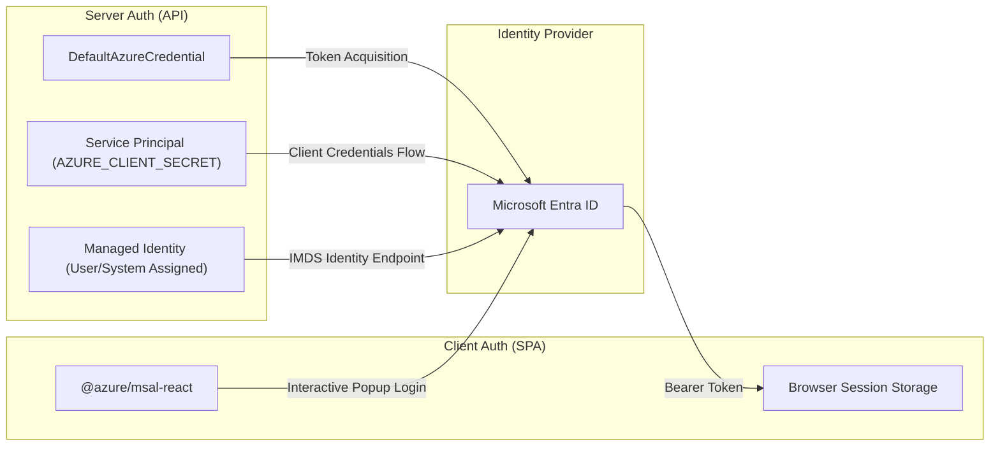
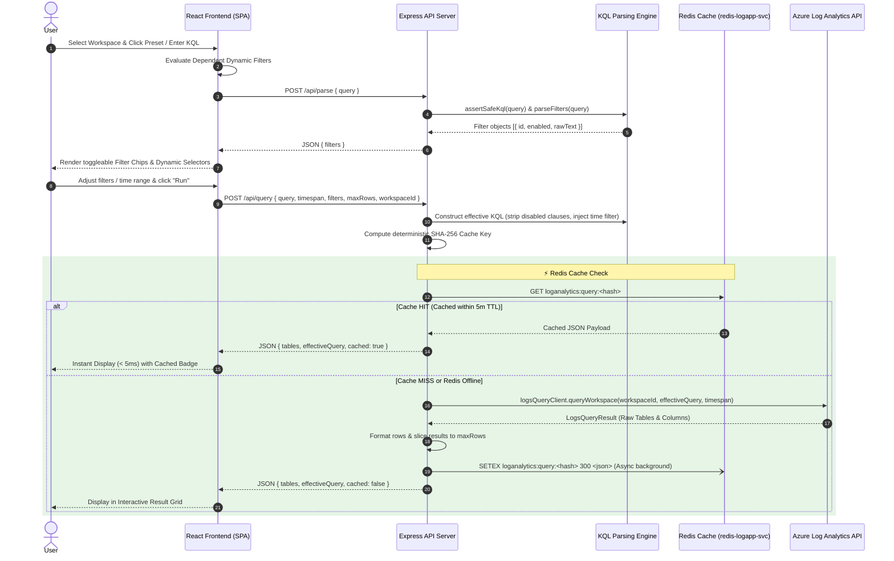
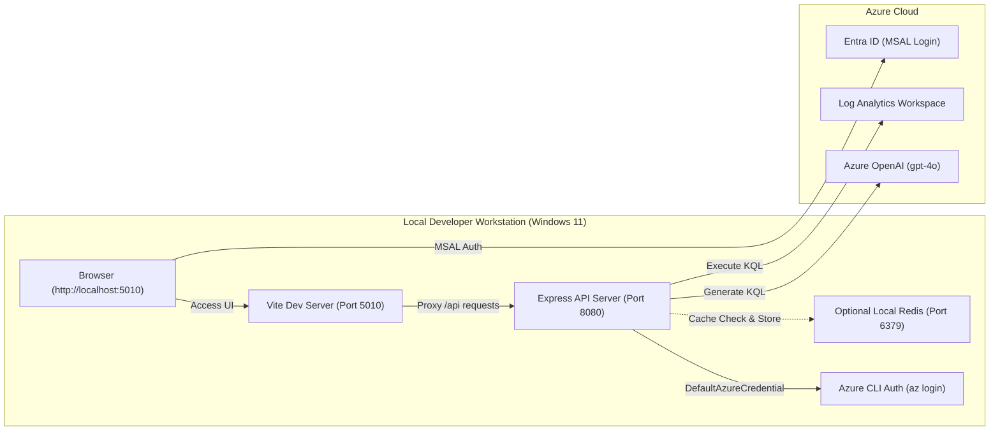

# Azure Log Analytics KQL App - System Architecture & Design

This document details the technical design, component structure, authentication flow, query execution pipeline, caching layer, and local/pod container deployment architectures.

---

## 1. High-Level Application & Component Architecture

The system uses a container-first, decoupled client-server architecture built with a React 18 Single Page Application (Vite, Port 5010), a Node.js Express API (Port 8080), and an in-cluster **1GB Redis Cache Pod** (`redis-logapp-svc:6379`) to accelerate repeat queries and eliminate Azure Log Analytics API latency.

```mermaid
graph TD
    subgraph ClientLayer ["Frontend SPA (Port 5010 / Production Static Bundle)"]
        UI["React 18 SPA (Pistachio Green Theme)"]
        AuthUI["MSAL OAuth 2.0 Auth Component"]
        FilterEngine["Hierarchical Dependent Filter Engine"]
        ResultGrid["Interactive Data Table (Click-Hold Drag Reorder)"]
    end

    subgraph BackendLayer ["Backend API Service (Express - Port 8080)"]
        Router["Express Router (/api)"]
        ZodVal["Zod Payload & Query Validator"]
        KqlGuard["KQL Parser & Command Guard"]
        RedisModule["Redis Cache Layer (ioredis - redis.ts)"]
        AzureSDK["Azure Log Analytics SDK (logAnalytics.ts)"]
    end

    subgraph CacheLayer ["In-Cluster Cache Layer (AKS)"]
        RedisPod["Redis Cache Pod: redis-logapp (1GB maxmemory / allkeys-lru)"]
    end

    subgraph AzureServices ["Azure Cloud Platform"]
        Entra["Microsoft Entra ID (Azure AD)"]
        ARG["Azure Resource Graph API"]
        LA["Azure Log Analytics Workspace"]
        OpenAI["Azure OpenAI (gpt-4o)"]
    end

    %% Interactions
    UI -->|1. Sign in & Fetch Token| Entra
    UI -->|2. Discover User Workspaces| ARG
    UI -->|3. Query API Request| Router
    Router --> ZodVal
    ZodVal --> KqlGuard
    KqlGuard --> RedisModule
    RedisModule -->|Check Cache / Fetch HIT| RedisPod
    RedisModule -->|Cache MISS: Forward Execution| AzureSDK
    AzureSDK -->|4. Authenticated KQL Execution| LA
    AzureSDK -->|Async Cache Write (TTL: 5m)| RedisPod
    Router -->|Ask AI Prompts| OpenAI
```

---

## 2. Authentication Architecture & Configuration

The application implements dual-mode authentication supporting both client-side OAuth 2.0 (MSAL) and server-side Azure credentials (SPN / Managed Identity):



### Authentication Modes & Configuration
- **User Single Sign-On (MSAL SPA)**:
  - `VITE_AZURE_CLIENT_ID`: Entra ID Application (Client) ID.
  - `VITE_AZURE_TENANT_ID`: Directory (Tenant) ID.
  - `VITE_REQUIRE_AZURE_AD_AUTH`: Controls interactive landing page (`true`/`false`).
  - **Dynamic Workspace Discovery**: Authenticated users query `microsoft.operationalinsights/workspaces` via Azure Resource Graph to populate the workspace dropdown selector.
- **Server-Side Authorization (SPN / Managed Identity)**:
  - `AZURE_TENANT_ID`, `AZURE_CLIENT_ID`, `AZURE_CLIENT_SECRET`: For Service Principal auth.
  - `DefaultAzureCredential`: Falls back automatically to Managed Identity in AKS / Container Apps or Azure CLI credentials during local development.

---

## 3. Query Execution & Caching Pipeline (End-to-End)

How KQL queries, dynamic predicate substitution, safety sanitization, Redis caching, and time-range filtering execute end-to-end:



---

## 4. Frontend & Backend Technical Architecture

### A. Frontend Single Page Application Architecture (Client)
- **Framework & Component Model**: Built on React 18 with TypeScript strict mode, bundled via Vite for optimized ESM module splitting.
- **State Management & Data Flow**:
  - Unidirectional state flow managing active query predicates, dynamic filters, workspace selections, and execution telemetry.
  - Multi-tab query state isolating workspace selections, parameters, and query responses per tab.
  - Asynchronous filter cache state mapping stable SHA-256 filter identifiers to active boolean toggles.
  - Multi-tenant MSAL authentication context managing OAuth 2.0 bearer token acquisition and automatic silent renewal (`acquireTokenSilent`).
- **Resource Graph Integration**: Executes KQL queries against Azure Resource Graph (`microsoft.operationalinsights/workspaces`) via standard fetch abstractions to dynamically discover Log Analytics workspaces under user RBAC scope.
- **Data Grid & Memory Performance**:
  - In-memory Virtualized Result Table handling tabular data payloads up to 50,000 rows without UI main-thread blocking.
  - Data-type aware sorting algorithms (`localeCompare` with numeric sensitivity, ISO-8601 timestamp parsing, numeric comparison).
  - Native HTML5 Drag-and-Drop column reordering maintaining immutable column ordinal index arrays in React state.
- **CSV Serialization**: Client-side streaming RFC-4180 compliant CSV string generation and browser Blob URL instantiation.

### B. Backend API Service Architecture (Server)
- **Runtime & Network Protocol**: Node.js runtime executing Express server listening on dual IPv4/IPv6 socket bindings (`0.0.0.0:8080`).
- **Environment Schema & Configuration**: Immutable environment validation at process startup using `zod` (`server/src/config.ts`), with strict root `.env` path resolution across npm workspace monorepo roots.
- **Security & Middleware Pipeline**:
  - `helmet`: Enforces strict HTTP security headers (HSTS, CSP, X-Content-Type-Options, X-Frame-Options).
  - `cors`: Evaluates incoming `Origin` headers against allowed domain lists configured in `CORS_ORIGIN`.
  - `express-rate-limit`: Memory-backed sliding window rate limiter restricting API request frequencies per IP.
  - `assertSafeKql`: AST/Regex security guard sanitizing incoming KQL strings against administrative mutations (`.create`, `.drop`, `.alter`, `.ingest`).
- **Redis In-Memory Caching Subsystem (`server/src/redis.ts`)**:
  - Connects to in-cluster Redis service (`redis-logapp-svc:6379`) using `ioredis`.
  - SHA-256 query parameter hashing (`workspaceId | timespan | maxRows | query`).
  - Configurable TTL (`REDIS_CACHE_TTL_SECONDS=300`) with LRU eviction.
  - **Fail-safe Graceful Degradation**: If Redis is offline or restarting, requests automatically bypass the cache and query Azure Log Analytics directly without throwing 500 errors.
- **Azure SDK Execution Engine**:
  - Uses `@azure/identity` (`DefaultAzureCredential`, `ClientSecretCredential`) and `@azure/monitor-query` (`LogsQueryClient`).
  - Request forwarding supporting client-provided Azure AD bearer tokens via Authorization header or fallback to server SPN / Managed Identity.
  - Result serialization converting Azure Log Analytics `LogsQueryResult` tables and columns into normalized JSON response structures.

---

## 5. Deployment Structures & Diagrams (Local & Kubernetes / Pod)

### A. Local Development Deployment Structure
In local development, Vite proxies API calls from port `5010` to Express on port `8080`, with optional local Redis container:



### B. Pod & Kubernetes (AKS) Deployment Structure
In containerized production (Docker / AKS), the application runs alongside a dedicated **1GB Redis Cache Pod (`redis-logapp`)** communicating over a private Kubernetes `ClusterIP` Service (`redis-logapp-svc`):

```mermaid
graph TD
    subgraph AKSCluster ["Azure Kubernetes Service (AKS) Cluster"]
        subgraph IngressLayer ["Ingress Layer"]
            IstioGw["Istio Ingress Gateway (HTTPS:443)"]
            VirtualService["VirtualService Routing Rules"]
        end

        subgraph AppDeployment ["Application Deployment (loganalytics-app)"]
            AppPod1["App Pod 1: loganalytics-app (Node.js Express :8080)"]
            AppPod2["App Pod 2: loganalytics-app (Node.js Express :8080)"]
            AppSvc["Service: loganalytics-app-svc (:8080)"]
        end

        subgraph RedisDeployment ["Redis Cache Deployment (redis-logapp)"]
            RedisPodInstance["Redis Pod: redis-logapp (redis:7-alpine / 1024MB maxmemory)"]
            RedisSvc["ClusterIP Service: redis-logapp-svc (:6379)"]
        end

        subgraph ClusterConfig ["Cluster Configuration"]
            K8sSecret["Opaque Secret (aks/secret.yaml)"]
            ManagedID["User-Assigned Managed Identity"]
        end
    end

    subgraph External ["External Clients & Azure Cloud Services"]
        Users["End Users (HTTPS)"]
        ACR["Azure Container Registry (ACR)"]
        AzureLA["Log Analytics Workspace"]
        OpenAIRes["Azure OpenAI Service"]
    end

    Users -->|HTTPS Requests| IstioGw
    IstioGw --> VirtualService
    VirtualService --> AppSvc
    AppSvc --> AppPod1
    AppSvc --> AppPod2
    
    AppPod1 <-->|Read / Write Cache (6379)| RedisSvc
    AppPod2 <-->|Read / Write Cache (6379)| RedisSvc
    RedisSvc --> RedisPodInstance

    ACR -->|Pull Images| AppDeployment
    K8sSecret -.->|Inject Env Vars (REDIS_HOST, Azure Keys)| AppDeployment
    ManagedID -.->|Assign Identity| AppDeployment

    AppPod1 -->|Query Logs (Cache Miss)| AzureLA
    AppPod2 -->|Query Logs (Cache Miss)| AzureLA
    AppPod1 -->|AI Chat Prompts| OpenAIRes
    AppPod2 -->|AI Chat Prompts| OpenAIRes
```
