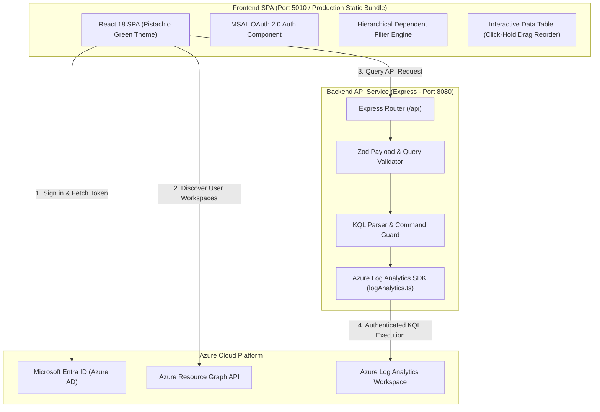
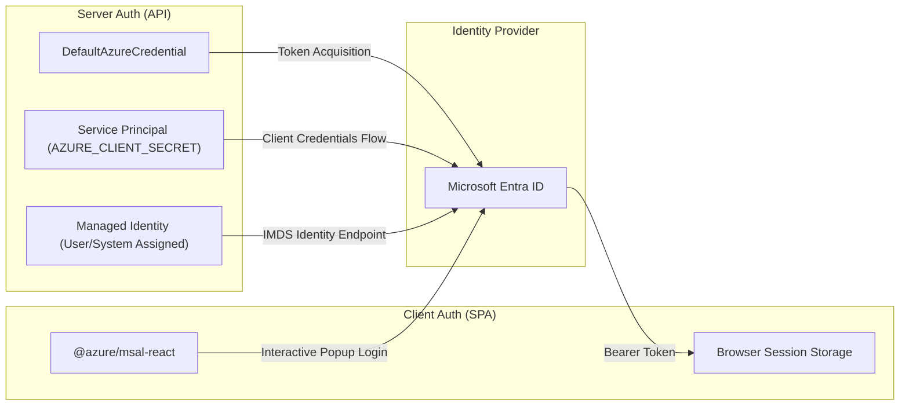
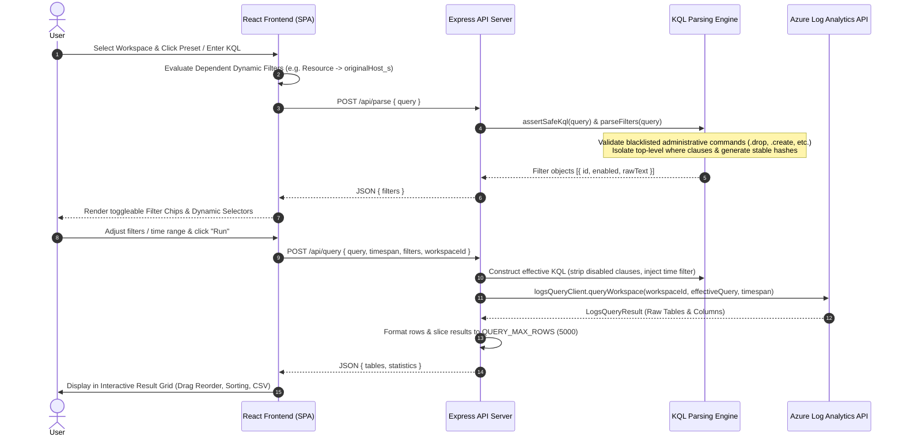
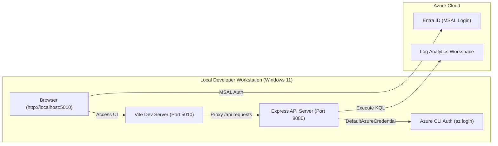
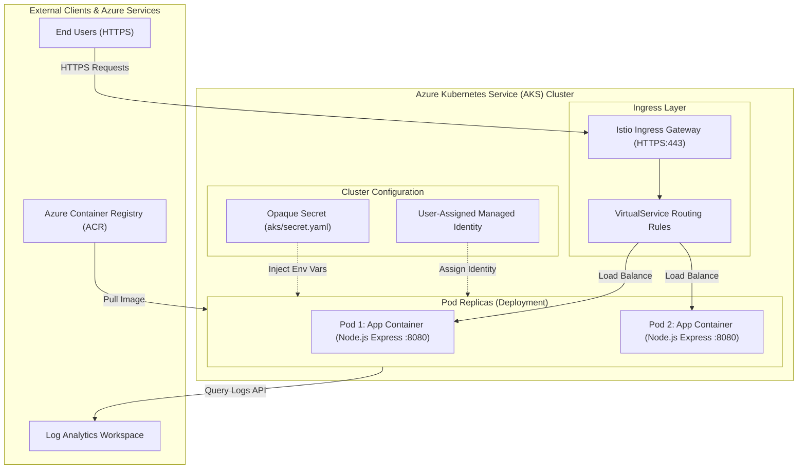

# Azure Log Analytics KQL App - System Architecture & Design

This document details the technical design, component structure, authentication flow, query execution pipeline, and local/pod container deployment architectures.

---

## 1. High-Level Application & Component Architecture

The system uses a container-first, decoupled client-server architecture built with a React 18 Single Page Application (Vite, Port 5010) and a Node.js Express API (Port 8080).

---

## 2. Authentication Architecture & Configuration

The application implements dual-mode authentication supporting both client-side OAuth 2.0 (MSAL) and server-side Azure credentials (SPN / Managed Identity):

### Authentication Modes & Configuration
- **User Single Sign-On (MSAL SPA)**:
  - `VITE_AZURE_CLIENT_ID`: Entra ID Application (Client) ID.
  - `VITE_AZURE_TENANT_ID`: Directory (Tenant) ID.
  - `VITE_REQUIRE_AZURE_AD_AUTH`: Controls interactive landing page (`true`/`false`).
  - **Dynamic Workspace Discovery**: Authenticated users query `microsoft.operationalinsights/workspaces` via Azure Resource Graph to populate the workspace dropdown selector.
- **Server-Side Authorization (SPN / Managed Identity)**:
  - `AZURE_TENANT_ID`, `AZURE_CLIENT_ID`, `AZURE_CLIENT_SECRET`: For Service Principal auth.
  - `DefaultAzureCredential`: Falls back automatically to Managed Identity in AKS / Container Apps or Azure CLI credentials during local development.

---

## 3. Query Execution Pipeline & KQL Engine Design

How KQL queries, dynamic predicate substitution, safety sanitization, and time-range filtering execute end-to-end:

---

## 4. Frontend & Backend Technical Architecture

### A. Frontend Single Page Application Architecture (Client)
- **Framework & Component Model**: Built on React 18 with TypeScript strict mode, bundled via Vite for optimized ESM module splitting.
- **State Management & Data Flow**:
  - Unidirectional state flow managing active query predicates, dynamic filters, workspace selections, and execution telemetry.
  - Asynchronous filter cache state mapping stable SHA-256 filter identifiers to active boolean toggles.
  - Multi-tenant MSAL authentication context managing OAuth 2.0 bearer token acquisition and automatic silent renewal (`acquireTokenSilent`).
- **Resource Graph Integration**: Executes KQL queries against Azure Resource Graph (`microsoft.operationalinsights/workspaces`) via standard fetch abstractions to dynamically discover Log Analytics workspaces under user RBAC scope.
- **Data Grid & Memory Performance**:
  - In-memory Virtualized Result Table handling tabular data payloads up to 50,000 rows without UI main-thread blocking.
  - Data-type aware sorting algorithms (`localeCompare` with numeric sensitivity, ISO-8601 timestamp parsing, numeric comparison).
  - Native HTML5 Drag-and-Drop column reordering maintaining immutable column ordinal index arrays in React state.
- **CSV Serialization**: Client-side streaming RFC-4180 compliant CSV string generation and browser Blob URL instantiation.

### B. Backend API Service Architecture (Server)
- **Runtime & Network Protocol**: Node.js runtime executing Express server listening on dual IPv4/IPv6 socket bindings (`0.0.0.0:8080`).
- **Environment Schema & Configuration**: Immutable environment validation at process startup using `zod` (`server/src/config.ts`), with strict root `.env` path resolution across npm workspace monorepo roots.
- **Security & Middleware Pipeline**:
  - `helmet`: Enforces strict HTTP security headers (HSTS, CSP, X-Content-Type-Options, X-Frame-Options).
  - `cors`: Evaluates incoming `Origin` headers against allowed domain lists configured in `CORS_ORIGIN`.
  - `express-rate-limit`: Memory-backed sliding window rate limiter restricting API request frequencies per IP.
  - `assertSafeKql`: AST/Regex security guard sanitizing incoming KQL strings against administrative mutations (`.create`, `.drop`, `.alter`, `.ingest`).
- **Azure SDK Execution Engine**:
  - Uses `@azure/identity` (`DefaultAzureCredential`, `ClientSecretCredential`) and `@azure/monitor-query` (`LogsQueryClient`).
  - Request forwarding supporting client-provided Azure AD bearer tokens via Authorization header or fallback to server SPN / Managed Identity.
  - Result serialization converting Azure Log Analytics `LogsQueryResult` tables and columns into normalized JSON response structures.

---

## 5. Deployment Structures & Diagrams (Local & Kubernetes / Pod)

### A. Local Development Deployment Structure
In local development, Vite proxies API calls from port `5010` to Express on port `8080`:

### B. Pod & Kubernetes (AKS) Deployment Structure
In containerized production (Docker / AKS), single or multi-replica pod containers serve the production SPA bundle and Express API:

