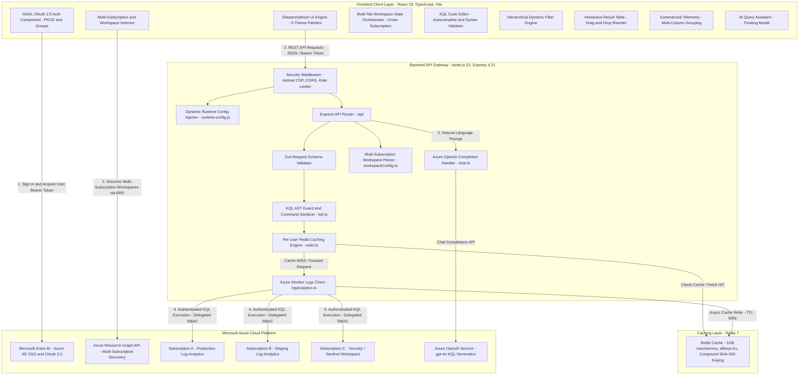
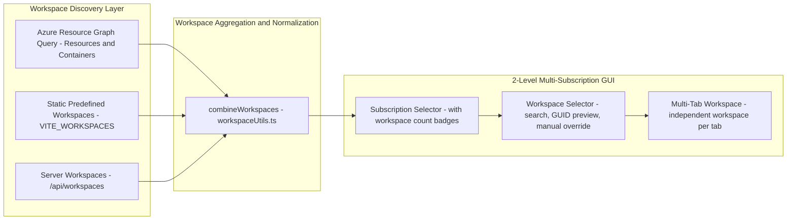
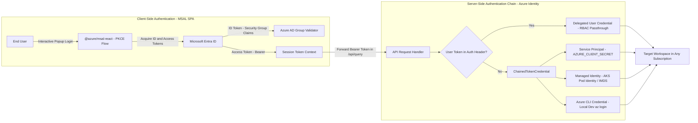
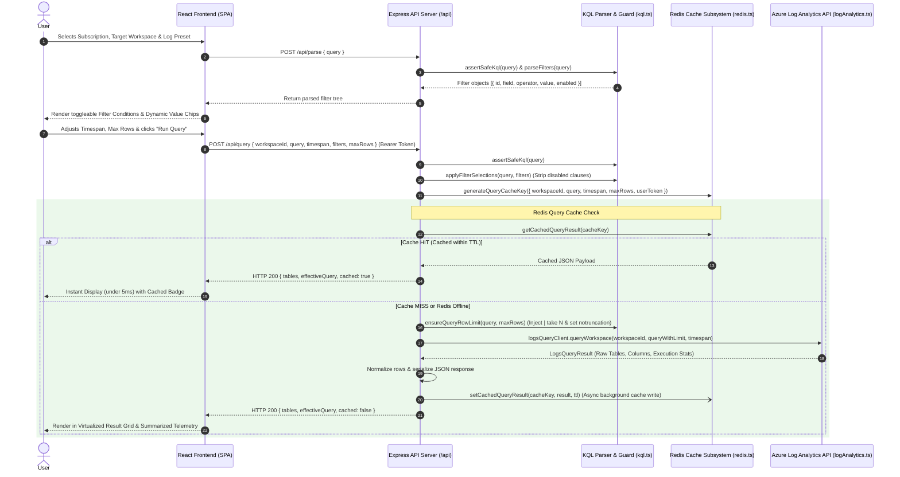
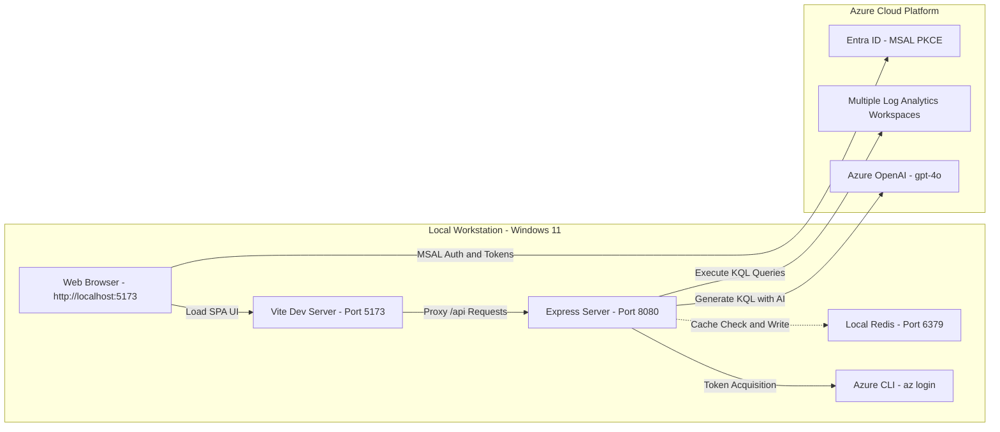
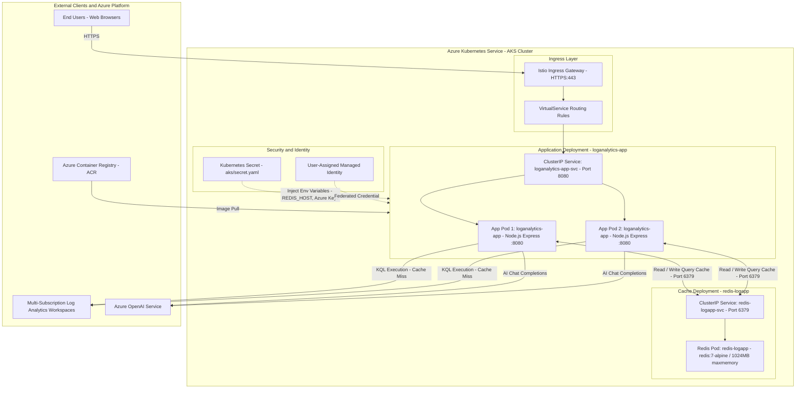

# Azure Log Analytics KQL Explorer — System Architecture & Technical Design

This document details the technical architecture, component design, authentication models, multi-subscription & multi-workspace query execution pipelines, caching layers, security controls, and deployment topologies (Local Development and Azure Kubernetes Service) for the Azure Log Analytics KQL Explorer application.

---

## 1. System Architecture Overview

The system utilizes a container-first, decoupled client-server architecture composed of a **React 19 Single Page Application (SPA)**, a **Node.js 22 / Express API Gateway**, an in-cluster **Redis Cache Subsystem**, and deep integrations with **Azure Cloud Services** (Azure Monitor Log Analytics, Azure Resource Graph, Microsoft Entra ID, and Azure OpenAI).

It is specifically architected as a **centralized multi-subscription, multi-workspace log explorer** that lets engineers view, compare, and query logs across multiple Azure subscriptions and resource groups from a single unified interface.


```mermaid
graph TD
    subgraph ClientLayer ["Frontend Client Layer - React 19, TypeScript, Vite"]
        UI["Glassmorphism UI Engine - 6 Theme Palettes"]
        AuthUI["MSAL OAuth 2.0 Auth Component - PKCE and Groups"]
        MultiSubCtrl["Multi-Subscription and Workspace Selector"]
        TabManager["Multi-Tab Workspace State Orchestrator - Cross-Subscription"]
        KqlEditor["KQL Code Editor - Autocomplete and Syntax Validator"]
        FilterEngine["Hierarchical Dynamic Filter Engine"]
        ResultGrid["Interactive Result Table - Drag and Drop Reorder"]
        TelemetryPanel["Summarized Telemetry - Multi-Column Grouping"]
        ChatbotUI["AI Query Assistant - Floating Modal"]
    end

    subgraph ServerLayer ["Backend API Gateway - Node.js 22, Express 4.21"]
        Middleware["Security Middleware - Helmet CSP, CORS, Rate Limiter"]
        RuntimeConfig["Dynamic Runtime Config Injector - runtime-config.js"]
        Router["Express API Router - /api"]
        ZodValidator["Zod Request Schema Validator"]
        WSParser["Multi-Subscription Workspace Parser - workspaceConfig.ts"]
        KqlSecurity["KQL AST Guard and Command Sanitizer - kql.ts"]
        RedisModule["Per-User Redis Caching Engine - redis.ts"]
        AzureSDK["Azure Monitor Logs Client - logAnalytics.ts"]
        ChatEngine["Azure OpenAI Completion Handler - chat.ts"]
    end

    subgraph CacheLayer ["Caching Layer - Redis 7"]
        RedisInstance["Redis Cache - 1GB maxmemory, allkeys-lru, Compound SHA-256 Keying"]
    end

    subgraph AzureCloud ["Microsoft Azure Cloud Platform"]
        EntraID["Microsoft Entra ID - Azure AD SSO and OAuth 2.0"]
        ARG["Azure Resource Graph API - Multi-Subscription Discovery"]
        Sub1["Subscription A - Production Log Analytics"]
        Sub2["Subscription B - Staging Log Analytics"]
        Sub3["Subscription C - Security / Sentinel Workspace"]
        OpenAIService["Azure OpenAI Service - gpt-4o KQL Generation"]
    end

    %% Client Interactions
    AuthUI -->|"1. Sign in and Acquire User Bearer Token"| EntraID
    MultiSubCtrl -->|"2. Discover Multi-Subscription Workspaces via ARG"| ARG
    UI -->|"3. REST API Requests - JSON / Bearer Token"| Middleware
    Middleware --> RuntimeConfig
    Middleware --> Router
    Router --> WSParser
    Router --> ZodValidator
    ZodValidator --> KqlSecurity
    
    %% Cache and Backend Execution
    KqlSecurity --> RedisModule
    RedisModule -->|"Check Cache / Fetch HIT"| RedisInstance
    RedisModule -->|"Cache MISS: Forward Request"| AzureSDK
    AzureSDK -->|"4. Authenticated KQL Execution - Delegated RBAC"| Sub1
    AzureSDK -->|"4. Authenticated KQL Execution - Delegated RBAC"| Sub2
    AzureSDK -->|"4. Authenticated KQL Execution - Delegated RBAC"| Sub3
    AzureSDK -->|"Async Cache Write - TTL: 500s"| RedisInstance
    Router -->|"5. Natural Language Prompt"| ChatEngine
    ChatEngine -->|"Chat Completions API"| OpenAIService
```

---

## 2. Multi-Subscription & Multi-Workspace Architecture

The application is engineered from the ground up for multi-subscription and multi-workspace log telemetry:


```mermaid
graph LR
    subgraph Discovery ["Workspace Discovery Layer"]
        ARGQuery["Azure Resource Graph Query - Resources and Containers"]
        EnvConfig["Static Predefined Workspaces - VITE_WORKSPACES"]
        ServerAPI["Server Workspaces - /api/workspaces"]
    end

    subgraph Resolution ["Workspace Aggregation and Normalization"]
        Combiner["combineWorkspaces - workspaceUtils.ts"]
    end

    subgraph UIControls ["2-Level Multi-Subscription GUI"]
        SubFilter["Subscription Selector - with workspace count badges"]
        WsPicker["Workspace Selector - search, GUID preview, manual override"]
        Tabs["Multi-Tab Workspace - independent workspace per tab"]
    end

    ARGQuery --> Combiner
    EnvConfig --> Combiner
    ServerAPI --> Combiner
    Combiner --> SubFilter
    SubFilter --> WsPicker
    WsPicker --> Tabs
```

### Multi-Subscription Operational Features
1. **Dynamic Resource Graph Resolution**: Client executes a specialized Resource Graph join query:
   ```kql
   Resources
   | where type =~ 'microsoft.operationalinsights/workspaces'
   | project id, name, customerId = tostring(properties.customerId), subscriptionId, resourceGroup
   | join kind=leftouter (
       ResourceContainers
       | where type =~ 'microsoft.resources/subscriptions'
       | project subscriptionId, subscriptionName = name
   ) on subscriptionId
   | project id, name, customerId, subscriptionId, subscriptionName = coalesce(subscriptionName, subscriptionId), resourceGroup
   ```
   This resolves human-readable subscription names across all subscriptions the user has RBAC access to.
2. **2-Level GUI Selector**:
   - Level 1: **Subscription Filter** (`GraphicalSubscriptionSelect.tsx`) narrows workspaces by Azure Subscription with dynamic count badges.
   - Level 2: **Workspace Selector** (`GraphicalWorkspaceSelect.tsx`) displays workspace name, customer ID GUID preview, subscription badge, and manual override toggle.
3. **Cross-Subscription Tab Isolation**: Each query tab in [App.tsx](file:///d:/Dinesh/LogAnalytics/client/src/App.tsx) isolates its own subscription and workspace context, enabling engineers to compare production, staging, and security logs side-by-side in separate tabs.

---

## 3. Authentication & Authorization Architecture

The system implements a robust dual-mode authentication hierarchy supporting both client-side interactive Single Sign-On (SSO) and server-side automated identities:


```mermaid
graph LR
    subgraph ClientAuthFlow ["Client-Side Authentication - MSAL SPA"]
        User["End User"] -->|"Interactive Popup Login"| MSAL["@azure/msal-react - PKCE Flow"]
        MSAL -->|"Acquire ID and Access Tokens"| EntraID["Microsoft Entra ID"]
        EntraID -->|"ID Token - Security Group Claims"| GroupGuard["Azure AD Group Validator"]
        EntraID -->|"Access Token - Bearer"| TokenStore["Session Token Context"]
    end

    subgraph ServerAuthFlow ["Server-Side Authentication Chain - Azure Identity"]
        ReqHandler["API Request Handler"] --> HasToken{"User Token in Auth Header?"}
        HasToken -->|"Yes"| UserCred["Delegated User Credential - RBAC Passthrough"]
        HasToken -->|"No"| ChainedCred["ChainedTokenCredential"]
        ChainedCred --> SPN["Service Principal - AZURE_CLIENT_SECRET"]
        ChainedCred --> ManagedID["Managed Identity - AKS Pod Identity / IMDS"]
        ChainedCred --> AzCLI["Azure CLI Credential - Local Dev az login"]
    end

    TokenStore -->|"Forward Bearer Token in /api/query"| ReqHandler
    UserCred --> LogAnalyticsAPI["Target Workspace in Any Subscription"]
    SPN --> LogAnalyticsAPI
    ManagedID --> LogAnalyticsAPI
    AzCLI --> LogAnalyticsAPI
```

---

## 4. End-to-End Query Execution & Caching Pipeline


```mermaid
sequenceDiagram
    autonumber
    actor User
    participant UI as React Frontend (SPA)
    participant API as Express API Server (/api)
    participant KQL as KQL Parser & Guard (kql.ts)
    participant Redis as Redis Cache Subsystem (redis.ts)
    participant Azure as Azure Log Analytics API (logAnalytics.ts)

    User->>UI: Selects Subscription, Target Workspace & Log Preset
    UI->>API: POST /api/parse { query }
    API->>KQL: assertSafeKql(query) & parseFilters(query)
    KQL-->>API: Filter objects [{ id, field, operator, value, enabled }]
    API-->>UI: Return parsed filter tree
    UI-->>User: Render toggleable Filter Conditions & Dynamic Value Chips

    User->>UI: Adjusts Timespan, Max Rows & clicks "Run Query"
    UI->>API: POST /api/query { workspaceId, query, timespan, filters, maxRows } (Bearer Token)
    API->>KQL: assertSafeKql(query)
    API->>KQL: applyFilterSelections(query, filters) (Strip disabled clauses)
    API->>Redis: generateQueryCacheKey({ workspaceId, query, timespan, maxRows, userToken })
    
    rect rgb(235, 248, 235)
        Note over API,Redis: Redis Query Cache Check
        API->>Redis: getCachedQueryResult(cacheKey)
        alt Cache HIT (Cached within TTL)
            Redis-->>API: Cached JSON Payload
            API-->>UI: HTTP 200 { tables, effectiveQuery, cached: true }
            UI-->>User: Instant Display (under 5ms) with Cached Badge
        else Cache MISS or Redis Offline
            API->>KQL: ensureQueryRowLimit(query, maxRows) (Inject | take N & set notruncation)
            API->>Azure: logsQueryClient.queryWorkspace(workspaceId, queryWithLimit, timespan)
            Azure-->>API: LogsQueryResult (Raw Tables, Columns, Execution Stats)
            API->>API: Normalize rows & serialize JSON response
            API-)Redis: setCachedQueryResult(cacheKey, result, ttl) (Async background cache write)
            API-->>UI: HTTP 200 { tables, effectiveQuery, cached: false }
            UI-->>User: Render in Virtualized Result Grid & Summarized Telemetry
        end
    end
```

---

## 5. Deployment Topologies & Architectures

### A. Local Development Deployment Architecture
In local development, the Vite development server proxies API requests to Express, with Azure CLI credential chaining and optional local Redis caching:


```mermaid
graph LR
    subgraph DevStation ["Local Workstation - Windows 11"]
        Browser["Web Browser - http://localhost:5173"]
        Vite["Vite Dev Server - Port 5173"]
        Express["Express Server - Port 8080"]
        RedisLocal["Local Redis - Port 6379"]
        AzCLI["Azure CLI - az login"]
    end

    subgraph AzureServices ["Azure Cloud Platform"]
        Entra["Entra ID - MSAL PKCE"]
        Workspaces["Multiple Log Analytics Workspaces"]
        OpenAIInstance["Azure OpenAI - gpt-4o"]
    end

    Browser -->|"Load SPA UI"| Vite
    Vite -->|"Proxy /api Requests"| Express
    Browser -->|"MSAL Auth and Tokens"| Entra
    Express -.->|"Cache Check and Write"| RedisLocal
    Express -->|"Token Acquisition"| AzCLI
    Express -->|"Execute KQL Queries"| Workspaces
    Express -->|"Generate KQL with AI"| OpenAIInstance
```

### B. Production Container & Kubernetes (AKS) Deployment Architecture
In production, the application is packaged into a hardened Docker container, deployed to Azure Kubernetes Service (AKS), fronted by an Istio Ingress Gateway, and backed by a dedicated **1GB Redis Pod (`redis-logapp`)**:


```mermaid
graph TD
    subgraph AKSCluster ["Azure Kubernetes Service - AKS Cluster"]
        subgraph IngressGateway ["Ingress Layer"]
            Istio["Istio Ingress Gateway - HTTPS:443"]
            VirtualService["VirtualService Routing Rules"]
        end

        subgraph AppWorkload ["Application Deployment - loganalytics-app"]
            AppPod1["App Pod 1: loganalytics-app - Node.js Express :8080"]
            AppPod2["App Pod 2: loganalytics-app - Node.js Express :8080"]
            AppService["ClusterIP Service: loganalytics-app-svc - Port 8080"]
        end

        subgraph CacheWorkload ["Cache Deployment - redis-logapp"]
            RedisPodInstance["Redis Pod: redis-logapp - redis:7-alpine / 1024MB maxmemory"]
            RedisClusterIP["ClusterIP Service: redis-logapp-svc - Port 6379"]
        end

        subgraph SecurityContext ["Security and Identity"]
            K8sSecret["Kubernetes Secret - aks/secret.yaml"]
            ManagedIdentity["User-Assigned Managed Identity"]
        end
    end

    subgraph ExternalServices ["External Clients and Azure Platform"]
        Users["End Users - Web Browsers"]
        ACR["Azure Container Registry - ACR"]
        AzureLA["Multi-Subscription Log Analytics Workspaces"]
        AzureOpenAIRes["Azure OpenAI Service"]
    end

    Users -->|"HTTPS"| Istio
    Istio --> VirtualService
    VirtualService --> AppService
    AppService --> AppPod1
    AppService --> AppPod2

    AppPod1 <-->|"Read / Write Query Cache - Port 6379"| RedisClusterIP
    AppPod2 <-->|"Read / Write Query Cache - Port 6379"| RedisClusterIP
    RedisClusterIP --> RedisPodInstance

    ACR -->|"Image Pull"| AppWorkload
    K8sSecret -.->|"Inject Env Variables - REDIS_HOST, Azure Keys"| AppWorkload
    ManagedIdentity -.->|"Federated Credential"| AppWorkload

    AppPod1 -->|"KQL Execution - Cache Miss"| AzureLA
    AppPod2 -->|"KQL Execution - Cache Miss"| AzureLA
    AppPod1 -->|"AI Chat Completions"| AzureOpenAIRes
    AppPod2 -->|"AI Chat Completions"| AzureOpenAIRes
```

---

## 6. Security, Resilience & Compliance Summary

| Layer | Implementation | Security / Operational Benefit |
| :--- | :--- | :--- |
| **Cross-Subscription RBAC** | Delegated Bearer Token forwarding in `/api/query` | Preserves individual Azure IAM / RBAC restrictions per subscription and workspace. |
| **Authentication** | MSAL OAuth 2.0 PKCE + Azure AD Security Groups | Eliminates hardcoded passwords; restricts access to authorized group members. |
| **Query Sanitization** | `assertSafeKql` AST validator & regex guard | Prevents administrative schema mutation and KQL injection attacks. |
| **Data Protection** | Compound SHA-256 cache keys with User ID namespace | Prevents cross-tenant / cross-user query cache data leakage. |
| **API Resilience** | Non-blocking Redis fallback & API timeout guard | Ensures continuous application availability even if cache pod restarts. |
| **Network Security** | Helmet CSP, CORS whitelist, and Express Rate Limiter | Mitigates XSS, CSRF, clickjacking, and denial-of-service attempts. |
| **Zero Rebuild Deploy**| Dynamic `/runtime-config.js` injection | Enables immutable container promotion from Dev to Staging to Prod. |
