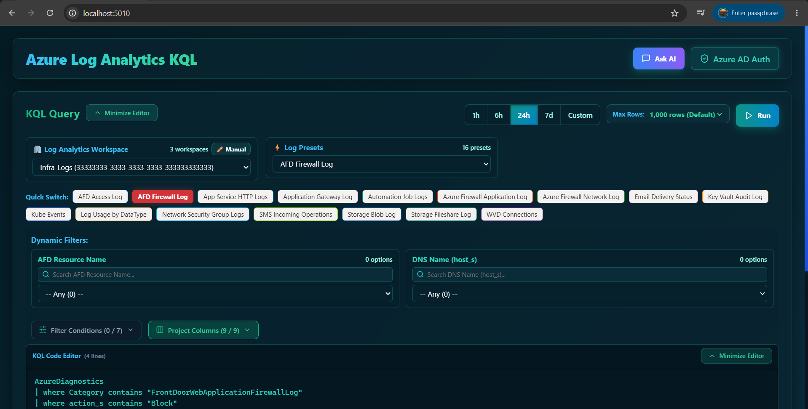

# Azure Log Analytics KQL Explorer

A container-first application designed for querying Azure Log Analytics workspaces, constructing KQL queries, and analyzing log telemetry with interactive GUI controls.



## Key Features & Functionality

- **AI-Powered KQL Assistant (`Ask AI`)**:
  - Click **Ask AI** in the top navigation bar to open the AI Assistant modal.
  - Describe what logs you want to investigate in plain English (e.g., *"Find all HTTP 500 errors from Application Gateway in the last 24 hours"*).
  - Integrates with Azure OpenAI (`gpt-4o`) to automatically generate optimized KQL queries with step-by-step technical explanations.
  - Generates KQL code that automatically populates into the editor for instant 1-click execution.

- **Query Row Limit Selector (`Max Rows`)**:
  - Select query maximum row limits (`100`, `500`, `1000`, `2500`, `5000`, `10000`, `50000` rows) directly from the query toolbar before running queries.
  - Default value set to `1000` rows to optimize performance and backend memory usage while preventing browser DOM overload.

- **Alphabetically Sorted Log Presets Library**:
  - Interactive **⚡ Log Presets** dropdown menu and **Quick Switch** chips, automatically sorted in strict alphabetical order by name:
    - **AFD Access Log** (`AzureDiagnostics` FrontDoorAccessLog)
    - **AFD Firewall Log** (`AzureDiagnostics` FrontDoorWebApplicationFirewallLog)
    - **App Gateway Log** (`AzureDiagnostics` ApplicationGatewayAccessLog)
    - **App Service HTTP Logs** (`AppServiceHTTPLogs`)
    - **Automation Job Logs** (`AzureDiagnostics` MICROSOFT.AUTOMATION JobLogs)
    - **Azure Firewall Application Log** (`AzureDiagnostics` AZFWApplicationRule)
    - **Azure Firewall Network Log** (`AzureDiagnostics` NetworkRule)
    - **Email Delivery Status** (`ACSEmailStatusUpdateOperational`)
    - **Key Vault Audit Log** (`AzureDiagnostics` MICROSOFT.KEYVAULT AuditEvent)
    - **Kube Events** (`KubeEvents`)
    - **Log Usage by DataType** (`Usage` billable volume summary by DataType per day)
    - **Network Security Group Logs** (`AzureDiagnostics` NetworkSecurity with `ResourceGroup` & `Resource` dynamic filters)
    - **SMS Incoming Operations** (`ACSSMSIncomingOperations` with `OperationName` & `PhoneNumber` dynamic filters)
    - **Storage Blob Log** (`StorageBlobLogs`)
    - **Storage Fileshare Log** (`StorageFileLogs`)
    - **WVD Connections** (`WVDConnections` Azure Virtual Desktop telemetry)

- **Interactive Dynamic Filters & KQL Preview**:
  - Dynamic filter dropdowns populated via live distinct value queries from Azure Log Analytics.
  - Smart query stripping engine (`fetchDynamicFilters`) that strips post-aggregation operations (`summarize`, `order by`, `project`, `render`) when fetching distinct filter values to ensure 100% dropdown population.
  - GUI condition controls with real-time `⚡ KQL Preview` bar.
  - Multiple condition operators supported: `==`, `!=`, `contains`, `!contains`, and `between` (e.g., `between (400 .. 599)`).

- **Isolated Table Body Scrollbar & Column Tools**:
  - Vertical scrollbar is strictly contained within the table body scroll area (`.table-body-wrap`) below column headers, preventing scrollbar overlap on Column Names.
  - Direct click-hold drag header reordering to customize column sequence.
  - Synchronized horizontal scrollbar across header and body tables.
  - Multi-operator primary result filtering (`==`, `!=`, `contains`, `!contains`) with visual active filter pills.
  - Page size customization (`50`, `100`, `200`, `500`, `1000` rows per page), dynamic pagination, type-aware sorting (numeric, ISO timestamp, string), CSV export, and Local/UTC timezone toggles.

- **Summarized Result Output & KQL Group By Breakdown**:
  - Analytical summary table displaying distinct value frequency counts (`Count`) and percentage share (`% Share`) with progress indicators.
  - **KQL Multi-Column Grouping (`| summarize count() by ...`)**: Select multiple columns (e.g., `requestUri_s` and `clientIP_s`) to execute AND tuple grouping, displaying exact combination counts for each URI per Client IP.
  - **Cascading Filter Dropdown**: 2-level menu allowing multi-column checking and specific sub-value selection per column.
  - **Interactive Column Header Sorting**: Click any header (`Column Name`, `Distinct Output Value`, `Count`, `% Share`, or dynamic column headers) to sort rows in Ascending (`↑`) or Descending (`↓`) order.
  - **Dynamic View Scope Toggle**: Switch between summarizing over active primary filtered results (`Filtered`) or the total dataset (`All Rows`).

- **Secure Azure AD Auth & Workspace Discovery**:
  - Secure Azure AD authentication (MSAL SPA) with dynamic Azure Resource Graph workspace discovery and Service Principal (SPN) / Managed Identity support.

---

## AI-Powered KQL Generation (`Ask AI`)

The application features an integrated AI Assistant powered by Azure OpenAI to help users construct complex KQL queries effortlessly:

1. **Natural Language to KQL Translation**:
   - Click the **Ask AI** button at the top right of the navigation bar.
   - Enter natural language questions or prompt requests such as:
     - *"Find all blocked traffic from Azure Firewall for client IP 10.0.0.45"*
     - *"Summarize top 10 request URIs with high latency on Application Gateway"*
     - *"List failed authentication attempts in Key Vault during the last 7 days"*

2. **Automated KQL Editor Population**:
   - The AI Assistant generates valid KQL queries formatted specifically for Azure Log Analytics schemas.
   - The generated KQL query can be copied or loaded directly into the KQL Code Editor with a single click (`Apply Query`).

3. **Backend Azure OpenAI Configuration**:
   - Enabled by configuring `AZURE_OPENAI_ENDPOINT`, `AZURE_OPENAI_API_KEY`, and `AZURE_OPENAI_DEPLOYMENT` (e.g., `gpt-4o`) in `.env` or Kubernetes secret manifests.

---

## Summarized Result Output & Breakdown

The application includes a dedicated **Summarized Telemetry** panel located below the primary result table:

1. **Multi-Column KQL Grouping**:
   - Selecting 1 column displays frequency breakdown for that field.
   - Selecting 2 or more columns performs multi-column tuple grouping (`| summarize count() by col1, col2`), rendering separate columns for each field and computing exact occurrence counts.

2. **Sub-Value Filtering & View Scope**:
   - Check specific sub-values per column to refine summary telemetry.
   - Toggle between **Filtered** (evaluates active primary table filters) and **All Rows** (evaluates raw query output).

3. **Column Header Sorting**:
   - Click any table header to toggle Ascending (`↑`) or Descending (`↓`) sort order.

---

## Application Architecture & Technical Design

### Technologies Used
- **Frontend**: React 19, TypeScript, Vite, Lucide Icons, `@azure/msal-react`, `@azure/msal-browser`.
- **Backend**: Node.js 22, Express, TypeScript, Zod, `@azure/monitor-query-logs`, `@azure/identity`, OpenAI SDK (`azure-openai`), Helmet, Express-Rate-Limit.
- **Packaging & Monorepo**: Managed via npm workspaces (`client/` and `server/`).

### Frontend & Backend Communication
- Communication between the client and server occurs via a secure REST API over HTTP/HTTPS using JSON payloads.
- **Development Mode**: Vite dev server (`http://localhost:5173`) proxies `/api/*` requests to the Express backend (`http://localhost:8080`).
- **Production Mode**: The Express server directly serves both `/api/*` endpoints and the compiled single-page static React build (`client/dist`).

### Azure AD Authentication & Azure SDK Integration
- **User Authentication**: Frontend integrates `@azure/msal-react` for Single Sign-On (SSO) using Microsoft Entra ID (Azure AD). Users sign in using OAuth 2.0 Authorization Code Flow with PKCE.
- **Dynamic Workspace Discovery**: Client uses the user's OAuth access token to query Azure Resource Graph (`microsoft.operationalinsights/workspaces`) and fetch all Log Analytics Workspaces the user has permissions to view.
- **Log Analytics Execution**: Backend queries Log Analytics using `@azure/monitor-query-logs` authenticated via `@azure/identity` using `DefaultAzureCredential`, Service Principal (`AZURE_CLIENT_SECRET`), or container Managed Identity.

---

## Azure Access & Configuration

Grant the application identity access to the Log Analytics workspace (e.g., `Log Analytics Reader` role).

Configurable via environment variables or Kubernetes secrets:
- Service Principal (SPN): `AZURE_TENANT_ID`, `AZURE_CLIENT_ID`, `AZURE_CLIENT_SECRET`
- Azure OpenAI Integration: `AZURE_OPENAI_ENDPOINT`, `AZURE_OPENAI_API_KEY`, `AZURE_OPENAI_DEPLOYMENT`

---

## Local Development & Execution

```powershell
npm run install:all
npm run dev
```

To run a production build locally:
```powershell
npm run production
```

---

## Container & AKS Production Deployment

### 1. Configure Cluster Credentials
Copy `aks/deploy-config.example.json` to `aks/deploy-config.json` and configure your Azure Subscription, Resource Group, Cluster Name, and ACR Registry:
```json
{
  "SubscriptionId": "00000000-0000-0000-0000-000000000000",
  "ResourceGroup": "rg-loganalytics-prod",
  "ClusterName": "aks-cluster-prod",
  "AcrName": "myacrregistry",
  "ImageName": "loganalytics-app",
  "ImageTag": "latest"
}
```

### 2. Master All-in-One Production Deployment Script
Run the master deployment script from the project root:
```powershell
.\scripts\deploy-prod.ps1
```
The script builds the Docker image, pushes it to ACR, prompts for user confirmation (`Y/N`), connects to AKS, and applies Kubernetes manifests (`aks/secret.yaml`, `aks/deployment.yaml`, `aks/istio-ingress.yaml`).
