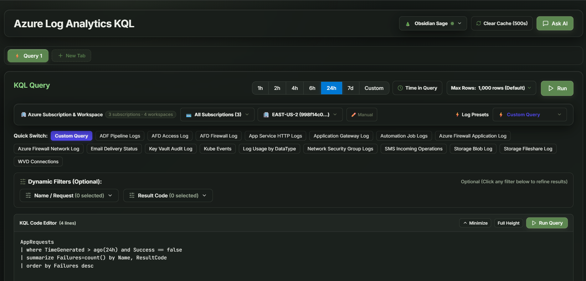
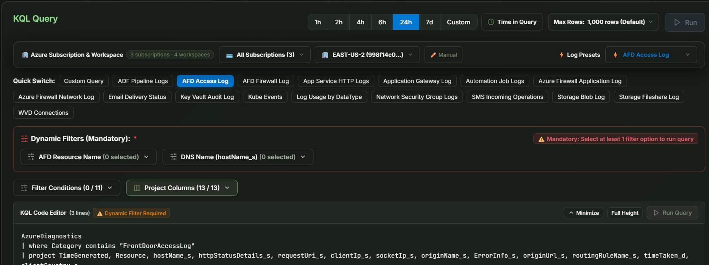

# Azure Log Analytics KQL Explorer — Multi-Subscription & Multi-Workspace Log Viewer

An enterprise, container-first web application designed for **centralized multi-subscription and multi-workspace log viewing**, querying Azure Log Analytics workspaces across entire Azure tenants, constructing Kusto Query Language (KQL) queries, and analyzing log telemetry with high-density interactive GUI controls, GPU-accelerated glassmorphic themes, and an integrated AI assistant.



---

## Centralized Multi-Subscription & Multi-Workspace Log View

This application is purpose-built as a **single-pane-of-glass multi-subscription and multi-workspace telemetry viewer**:

* 🌐 **Cross-Subscription & Cross-Tenant Visibility**: Seamlessly inspect and query logs across multiple Azure Subscriptions and Resource Groups from a single unified UI without hopping between different Azure Portal blades.
* 🏷️ **2-Level Subscription & Workspace Selector**:
  * **Subscription Filter**: Categorizes workspaces by Azure Subscription with dynamic badge counters (e.g., `Production (8)`, `Staging (4)`, `Security (2)`).
  * **Workspace Picker**: Searchable dropdown displaying workspace names, subscription tags, customer ID GUID previews, and manual workspace GUID overrides.
* 📑 **Multi-Tab Multi-Workspace Side-by-Side Analysis**:
  * Open multiple tabs simultaneously to compare telemetry across different subscriptions and environments (e.g., Tab 1: `Production/EastUS-Logs`, Tab 2: `Staging/WestEurope-Logs`, Tab 3: `Security/Sentinel-Workspace`).
  * Each tab maintains completely isolated workspace contexts, query texts, dynamic filters, timespans, and result tables.
* 🔍 **Dynamic Resource Graph Discovery**:
  * Automatically discovers all Log Analytics workspaces accessible to the user across all subscriptions using Azure Resource Graph (`microsoft.operationalinsights/workspaces` joined with `microsoft.resources/subscriptions`) under user RBAC permissions.


---

## Key Features & Capabilities

### 1. 🌐 Multi-Subscription & Multi-Workspace Selector
- **Interactive Subscription Selector**: Filter workspaces by subscription with active count badges and instant subscription switching.
- **Searchable Workspace Selector**: Fast real-time fuzzy search across workspace names, customer IDs (UUIDs), and parent subscriptions.
- **Manual Workspace Override**: Toggle manual GUID entry to query any Log Analytics workspace directly.

### 2. 🤖 AI-Powered KQL Assistant (`Ask AI`)
- **Natural Language to KQL**: Click **Ask AI** in the top navigation bar to open the AI Query Assistant modal powered by Azure OpenAI (`gpt-4o`).
- **Contextual Query Generation**: Describe your investigation in plain English (e.g., *"Find all 5xx HTTP errors on Application Gateway in the last 6 hours grouped by client IP"* or *"List failed Azure Firewall network connections for port 443"*).
- **Technical Explanations & 1-Click Apply**: Returns optimized KQL queries along with step-by-step breakdown. Click **Apply Query** to instantly load the generated query into the active KQL editor tab.

### 3. 🎨 Glassmorphism UI & 6 Theme Palettes
- High-contrast, GPU-accelerated glassmorphism design system with smooth backdrop blurs and subtle borders.
- **6 Distinct Color Palettes**:
  - 🌲 **Obsidian Sage** *(Default Dark)*: Deep dark obsidian backdrop with soft milk luminescence and moss sage accents.
  - 🥛 **Milk White** *(Light Mode)*: Frosted ivory milk glass with sage borders and olive accents.
  - 🌌 **Midnight Azure**: Deep space navy with electric Azure telemetry cyan and blue accents.
  - 🔮 **Royal Amethyst**: Deep royal purple velvet with neon lavender luminescence.
  - 🌅 **Sunset Amber**: Warm espresso backdrop with glowing golden amber accents.
  - ❄️ **Arctic Glacier**: Deep arctic fjord with polar glacier mint teal accents.

### 4. ⚡ Alphabetical Log Presets Library (18 Presets)
Interactive **⚡ Log Presets** dropdown menu and **Quick Switch** chips, automatically sorted in strict alphabetical order:
- **ADF Pipeline Logs** (`AzureDiagnostics` with `FACTORIES` resource type & failure status)
- **AFD Access Log** (`AzureDiagnostics` FrontDoorAccessLog with client IP & routing rules)
- **AFD Firewall Log** (`AzureDiagnostics` FrontDoorWebApplicationFirewallLog WAF actions)
- **App Gateway Log** (`AzureDiagnostics` ApplicationGatewayAccessLog with status & latency)
- **App Service HTTP Logs** (`AppServiceHTTPLogs` IIS access telemetry & status codes)
- **Automation Job Logs** (`AzureDiagnostics` MICROSOFT.AUTOMATION JobLogs)
- **Azure Firewall Application Log** (`AzureDiagnostics` AZFWApplicationRule with FQDN & TLS inspection)
- **Azure Firewall Network Log** (`AzureDiagnostics` NetworkRule with parsed AdditionalFields)
- **Email Delivery Status** (`ACSEmailStatusUpdateOperational` Azure Communication Services)
- **Key Vault Audit Log** (`AzureDiagnostics` MICROSOFT.KEYVAULT AuditEvent & UPN identities)
- **Kube Events** (`KubeEvents` Kubernetes cluster events & namespaces)
- **Log Usage by DataType** (`Usage` billable volume summary in GB per DataType per day)
- **Network Security Group Logs** (`AzureDiagnostics` NetworkSecurity with directional flow)
- **SMS Incoming Operations** (`ACSSMSIncomingOperations` delivery & phone numbers)
- **Storage Blob Log** (`StorageBlobLogs` container operations & IP addresses)
- **Storage Fileshare Log** (`StorageFileLogs` SMB access & minor status codes)
- **WVD Connections** (`WVDConnections` Azure Virtual Desktop telemetry)
- **Custom Query** (Blank starter template for direct KQL composition)

### 5. 📑 Multi-Tab Query Workspace
- Work with multiple isolated query tabs (`Query 1`, `Query 2`, etc.) simultaneously.
- Each tab maintains its own independent state: KQL editor query text, active preset, dynamic filters, filter conditions, column projections, selected subscription, workspace ID, timespan, max rows, and result dataset.
- Clean tab switching, adding, closing, and automatic workspace isolation.

### 6. 🔍 Dynamic Filters & Live KQL Preview
- Dynamic filter dropdowns automatically populated via live distinct value queries from Azure Log Analytics.
- Smart query stripping engine (`fetchDynamicFilters`) that strips post-aggregation operations (`summarize`, `order by`, `project`, `render`) when fetching distinct filter values to ensure 100% dropdown population.
- GUI condition controls with real-time `⚡ KQL Preview` bar.
- Supported operators: `==`, `!=`, `contains`, `!contains`, `<`, `<=`, `>`, `>=`, and `between (min .. max)`.

### 7. ✍️ KQL Code Editor with Autocomplete & Real-Time Linting
- **Intellisense Autocomplete**: Interactive keyword and column suggestions as you type (`where`, `project`, `summarize`, `extend`, `order by`, `count()`, `ago()`, `contains`, `between`, `take`, etc.).
- **Real-Time Syntax Error Diagnostics**: Detects unbalanced quotes, unmatched brackets/parentheses, misplaced pipes, trailing operators, and invalid keywords as you type with line-number alerts.
- **Adjustable Height Controls**: Easily switch editor height between Minimized, Normal, and Expanded views.

### 8. 📊 High-Density Interactive Result Table
- **Click-Hold Drag-and-Drop Column Reordering**: Grab any column header to rearrange column sequence dynamically.
- **Column Resizing**: Drag column borders to adjust widths for dense log examination.
- **Text Wrapping Modes**: Toggle between single-line truncation, cell-level wrapping, column wrapping, and global wrap.
- **Primary Result Column Filtering**: Multi-operator search pills (`==`, `!=`, `contains`, `!contains`) directly on table headers.
- **Type-Aware Sorting**: Numeric, ISO-8601 timestamp, and string comparisons.
- **Local / UTC Timezone Toggle**: Instantly convert ISO timestamps between UTC and local system time.
- **RFC-4180 CSV Export**: Stream and download full table datasets as standard CSV files.
- **Dynamic Pagination**: Choose page size (`50`, `100`, `200`, `500`, `1000` rows per page).

### 9. 📈 Summarized Result Output & Multi-Column Tuple Grouping
- Dedicated **Summarized Telemetry** panel below the main results:
  - **Single Column Breakdown**: Shows distinct value frequency counts and percentage share progress bars.
  - **Multi-Column KQL Tuple Grouping (`| summarize count() by ...`)**: Select 2 or more columns (e.g., `requestUri_s` + `clientIP_s`) to compute exact occurrence counts for every combination tuple.
  - **Sub-Value Filtering**: Filter specific sub-values per column to refine telemetry view.
  - **View Scope Toggle**: Switch between evaluating active primary table filters (*Filtered*) or the complete dataset (*All Rows*).
  - **Header Sorting**: Click any summary column header to toggle ascending/descending order.

### 10. ⚡ Per-User In-Cluster Redis Cache (1GB Pod)
- Connects to an in-cluster Redis Pod (`redis-logapp-svc:6379`) with LRU eviction and configurable TTL (`REDIS_CACHE_TTL_SECONDS=500`).
- **Compound SHA-256 Keying per User**: Caches query results using SHA-256 compound keys incorporating workspace ID, timespan, max rows, normalized query, and user identity (`oid`/`sub`/`upn`), ensuring complete multi-user isolation.
- Returns cached responses in < 5ms, dramatically cutting Azure Log Analytics API bills and latency.
- **Fail-Safe Graceful Fallback**: If Redis is restarting or offline, queries automatically fall back directly to Azure Log Analytics.
- **User Cache Invalidation**: Dedicated `/api/cache/clear` endpoint to purge cached entries on demand.

### 11. 🔐 Microsoft Entra ID (Azure AD) Single Sign-On & RBAC
- Single-page application OAuth 2.0 PKCE flow with Microsoft Authentication Library (`@azure/msal-react`).
- **Security Group Authorization**: Restrict application access to specific Azure AD Security Groups (`VITE_ALLOWED_AZURE_AD_GROUPS`).
- **Dynamic Azure Resource Graph Discovery**: Automatically discovers all Log Analytics workspaces accessible to the authenticated user across multiple subscriptions.
- **Backend Credential Delegation**: Passes user delegated tokens to Azure Monitor for end-to-end RBAC enforcement, with fallback to Service Principal (SPN) / Managed Identity / Azure CLI.

---

## Technologies Used

| Component | Stack | Details |
| :--- | :--- | :--- |
| **Frontend SPA** | React 19, TypeScript 5.7, Vite 6 | Lucide Icons, `@azure/msal-react`, `@azure/msal-browser`, Fontsource Inter & JetBrains Mono |
| **Backend API** | Node.js 22, Express 4.21, TypeScript | `@azure/monitor-query-logs`, `@azure/identity`, `openai`, `zod`, `helmet`, `cors`, `express-rate-limit` |
| **Caching Layer** | Redis 7 (Alpine), `ioredis` 5.6 | 1024MB maxmemory with `allkeys-lru` eviction & compound SHA-256 keying |
| **Monorepo Structure**| npm workspaces | Root orchestrator managing `client/` and `server/` packages |
| **Container & Cloud** | Docker, AKS, Istio Ingress | Zero-rebuild dynamic runtime configuration via `/runtime-config.js` |

---

## Configuration & Multi-Subscription Setup

Create a `.env` file in the project root (see [`.env.example`](file:///d:/Dinesh/LogAnalytics/.env.example) for a complete template):

```env
# Server Configuration
PORT=8080
NODE_ENV=development
CORS_ORIGIN=http://localhost:5173,http://localhost:5010,http://localhost:8080
QUERY_TIMEOUT_MS=120000
QUERY_MAX_ROWS=50000
QUERY_MAX_LENGTH=20000
RATE_LIMIT_MAX=300

# Redis Cache Configuration
REDIS_ENABLED=true
REDIS_HOST=localhost
REDIS_PORT=6379
REDIS_CACHE_TTL_SECONDS=500

# Backend Azure Credentials (Service Principal / Managed Identity fallback)
AZURE_TENANT_ID=00000000-0000-0000-0000-000000000000
AZURE_CLIENT_ID=00000000-0000-0000-0000-000000000000
AZURE_CLIENT_SECRET=your-spn-client-secret-value
LOG_ANALYTICS_WORKSPACE_ID=00000000-0000-0000-0000-000000000000
ALLOW_WORKSPACE_OVERRIDE=true

# Azure OpenAI (Ask AI Assistant)
AZURE_OPENAI_ENDPOINT=https://your-openai-instance.openai.azure.com/
AZURE_OPENAI_API_KEY=your-azure-openai-api-key
AZURE_OPENAI_DEPLOYMENT=gpt-4o

# Frontend Azure AD MSAL Authentication (SPA)
VITE_REQUIRE_AZURE_AD_AUTH=true
VITE_AZURE_CLIENT_ID=00000000-0000-0000-0000-000000000000
VITE_AZURE_TENANT_ID=00000000-0000-0000-0000-000000000000
VITE_ALLOWED_AZURE_AD_GROUPS=SecOps-Admins,00000000-0000-0000-0000-000000000000

# Static Predefined Workspaces Across Multiple Subscriptions
# Format: SubscriptionName/WorkspaceName:WorkspaceCustomerId
VITE_WORKSPACES=Production/EastUS-Logs:11111111-1111-1111-1111-111111111111,Production/WestEurope-Logs:22222222-2222-2222-2222-222222222222,Staging/Stage-Logs:33333333-3333-3333-3333-333333333333,Security/Sentinel-Logs:44444444-4444-4444-4444-444444444444
```

---

## Local Development & Execution

### 1. Install Dependencies
```powershell
npm run install:all
```

### 2. Start Development Servers
Runs the Vite client (`http://localhost:5173`), Express API server (`http://localhost:8080`), and background health check concurrently:
```powershell
npm run dev
```

### 3. Run Unit Tests
```powershell
npm test
```

### 4. Build and Run Production Locally
```powershell
npm run production
```

---

## Container & AKS Production Deployment

### 1. Configure Cluster Deployment Parameters
Copy `aks/deploy-config.example.json` to `aks/deploy-config.json` and configure your Azure details:
```json
{
  "SubscriptionId": "00000000-0000-0000-0000-000000000000",
  "ResourceGroup": "rg-loganalytics-prod",
  "ClusterName": "aks-cluster-prod",
  "AcrName": "myacrregistry",
  "ImageName": "loganalytics-app",
  "ImageTag": "latest"
}
```

### 2. Master All-in-One Deployment Script
Execute the deployment script from the project root:
```powershell
.\scripts\deploy-prod.ps1
```
The script performs the following:
1. Builds the production multi-stage Docker container.
2. Authenticates and pushes the image to Azure Container Registry (ACR).
3. Connects to Azure Kubernetes Service (AKS).
4. Deploys Kubernetes Secrets ([aks/secret.yaml](file:///d:/Dinesh/LogAnalytics/aks/secret.yaml)).
5. Deploys the Redis Cache pod and Service ([aks/redis-deployment.yaml](file:///d:/Dinesh/LogAnalytics/aks/redis-deployment.yaml)).
6. Deploys the application workload ([aks/deployment.yaml](file:///d:/Dinesh/LogAnalytics/aks/deployment.yaml)) and Istio Ingress routing ([aks/istio-ingress.yaml](file:///d:/Dinesh/LogAnalytics/aks/istio-ingress.yaml)).

---

## Architecture & Code Documentation Links
- [System Architecture & Design Guide (`Architecture.md`)](file:///d:/Dinesh/LogAnalytics/Architecture.md)
- [Client Frontend Architecture & Component Guide (`client.md`)](file:///d:/Dinesh/LogAnalytics/client.md)
- [Server Backend Architecture & API Guide (`server.md`)](file:///d:/Dinesh/LogAnalytics/server.md)
- [Deployment & Operations Guide (`deployment.md`)](file:///d:/Dinesh/LogAnalytics/deployment.md)
