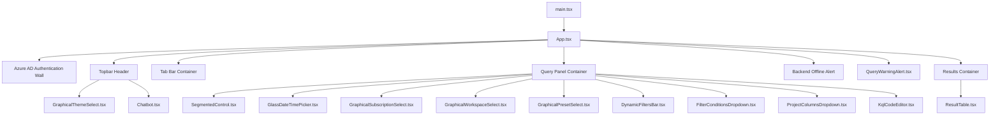
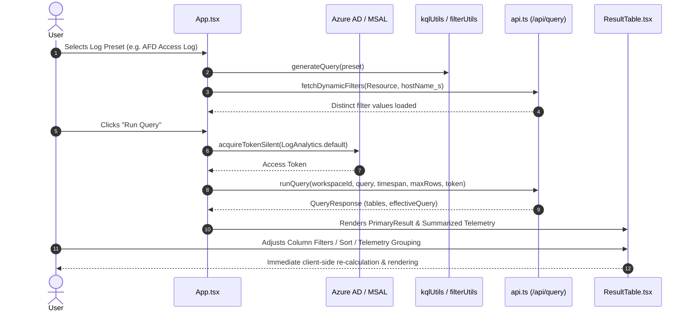

# Client Architecture & Code File Relationship Guide

## 1. Overview
The frontend is a high-density, enterprise-grade Azure Log Analytics query workspace built with **React 18**, **TypeScript**, **Vite**, **MSAL (Microsoft Authentication Library)**, and a **GPU-accelerated Glassmorphism Design System** with 6 theme palettes.

---

## 2. Directory Structure & Module Breakdown

```
client/src/
├── main.tsx                                  # Application bootstrapper & MSAL Provider setup
├── App.tsx                                   # Main workspace orchestrator & tab controller
├── types.ts                                  # Central TypeScript models, interfaces & type definitions
├── api.ts                                    # Backend REST API client & Azure Resource Graph caller
├── authConfig.ts                             # Azure AD / Entra ID MSAL configuration & token request scopes
├── env.ts                                    # Dynamic runtime-config (.env fallback) resolver
├── styles.css                                # Glassmorphism theme tokens, animations, and typography
├── Chatbot.tsx                               # Floating AI Query Assistant interface
│
├── constants/                                # Static configurations & metadata
│   ├── presets.ts                            # Starter query, 18 Log Presets & dynamic filter definitions
│   ├── themes.ts                             # 6 Theme configs (Dark, Light, Midnight, Amethyst, Amber, Nordic)
│   └── kql.ts                                # Valid KQL operators and autocomplete dictionary
│
├── utils/                                    # Pure business logic & transformation utilities
│   ├── filterUtils.ts                        # Filter clause formatting, value matching, column relationships
│   ├── kqlUtils.ts                           # KQL AST mutator, syntax validator, query generator
│   ├── workspaceUtils.ts                     # Predefined & server workspace resolvers, tab initializers
│   └── formatUtils.ts                        # Cell value formatter, CSV serializer, ISO date helpers
│
└── components/                               # Modular UI component hierarchy
    ├── common/                               # Generic reusable micro-components
    │   ├── SegmentedControl.tsx              # Timespan rapid selection pill control
    │   ├── GlassDateTimePicker.tsx           # Glass calendar & time picker popover
    │   └── QueryWarningAlert.tsx             # Collapsible execution warning & truncation alert
    ├── selectors/                            # Header & workspace selectors
    │   ├── GraphicalSubscriptionSelect.tsx   # Subscription filter dropdown with workspace counters
    │   ├── GraphicalWorkspaceSelect.tsx      # Multi-workspace search, selection & manual GUID input
    │   ├── GraphicalPresetSelect.tsx         # Predefined log presets selector with category colors
    │   └── GraphicalThemeSelect.tsx          # Multi-palette theme switcher with swatch preview
    ├── editor/                               # Query input & syntax validation
    │   └── KqlCodeEditor.tsx                 # High-density KQL editor with autocomplete & syntax errors
    ├── controls/                             # Query query-builder dropdowns
    │   ├── FilterConditionsDropdown.tsx      # Multi-select predicate conditions with operator controls
    │   ├── ProjectColumnsDropdown.tsx        # Projection columns multi-select dropdown
    │   └── DynamicFiltersBar.tsx             # Dynamic filter chips & multiselect dropdown bars
    └── table/                                # Data display & telemetry
        └── ResultTable.tsx                   # PrimaryResult grid, Value filter flyout & Summarized Column Telemetry
```

---

## 3. Component Hierarchy & Code Relationships



---

## 4. Module Details & File Contracts

### 4.1 State & Types (`src/types.ts`)
Consolidates all core data contracts across the application:
- `TabState`: Represents an isolated query workspace tab (query, timespan, maxRows, workspaceId, selectedSubscription, result, activePreset, presetOptions, presetProjectColumns, dynamicFilterValues, selectedDynamicFilters, optionOperators, optionValues, customStart, customEnd).
- `PresetQuery`: Model for built-in log queries (id, name, baseQuery, options, projectColumns, dynamicFilters).
- `DynamicFilterDef`: Template generator for dynamic distinct filters.
- `QueryResponse` & `QueryTable`: Tabular Azure log query response schemas.
- `FilterOperator`: Binary comparison operators (`==`, `!=`, `contains`, `!contains`, `<`, `<=`, `>`, `>=`).
- `KqlSyntaxError`: Real-time editor syntax diagnostics.

### 4.2 Utility Modules (`src/utils/`)
- **`filterUtils.ts`**: Pure functions for formatting KQL clauses (`formatFilterClause`, `buildOptionClause`), matching values (`matchesValueOperator`, `evaluateFilterCondition`), and computing related columns (`getRelatedColumns`).
- **`kqlUtils.ts`**: High-performance KQL parser and query AST builder:
  - `validateKql`: Client-side linter checking unbalanced quotes, parentheses, empty pipes, trailing operators, invalid assignment operators, and `between` / `in` syntax.
  - `updateQueryConditionOption`, `updateQueryDynamicFilter`, `updateQueryProjectColumns`, `updateQueryTimespan`: Mutates KQL text in real-time preserving user formatting.
  - `generateQuery`: Constructs initial KQL string from preset metadata and user selections.
- **`workspaceUtils.ts`**:
  - `getPredefinedWorkspaces`: Reads `.env` / runtime configuration strings formatted as `Subscription/Workspace:CustomerId`.
  - `combineWorkspaces`: Merges Azure Resource Graph discovered workspaces with server & local configurations without duplicates.
  - `createInitialTab`: Factory function for tab states.
- **`formatUtils.ts`**:
  - `formatCell`: ISO datetime detection with UTC / Local Time conversion.
  - `toCsv` & `csvEscape`: RFC 4180 compliant CSV export generator.

### 4.3 Component Modules (`src/components/`)
- **`selectors/`**:
  - `GraphicalSubscriptionSelect.tsx`: Subscription filter with active workspace count badges.
  - `GraphicalWorkspaceSelect.tsx`: Searchable workspace picker with GUID preview and manual switch.
  - `GraphicalPresetSelect.tsx`: Categorized log preset selector with preset dot swatches.
  - `GraphicalThemeSelect.tsx`: UI Theme picker with real-time swatch palette indicators.
- **`editor/`**:
  - `KqlCodeEditor.tsx`: High-density code editor with keyboard navigation, draggable floating autocomplete popover, live syntax diagnostic banners, and height toggles (minimized, normal, expanded).
- **`controls/`**:
  - `FilterConditionsDropdown.tsx`: Multi-select predicate conditions with operator selectors and direct value inputs.
  - `ProjectColumnsDropdown.tsx`: Projection columns multi-select dropdown with select-all/clear-all actions.
  - `DynamicFiltersBar.tsx`: Dynamic distinct value filter dropdowns with tag chips and search.
- **`table/`**:
  - `ResultTable.tsx`: PrimaryResult table with column reordering (drag-and-drop), column resizing, text wrapping (cell, column, row, global), UTC/Local time toggle, and CSV export.
  - Includes **Summarized Column Telemetry**: Multi-column tuple frequency grouping (`| summarize count() by ...`), percentage share progress bars, and pagination.

---

## 5. End-to-End Data & State Flow


