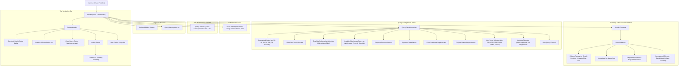

# Client Frontend Architecture & File Relationship Guide

## 1. Overview & Architectural Principles

The frontend is an enterprise-grade, high-density **Multi-Subscription & Multi-Workspace Azure Log Analytics query workspace** built with **React 19**, **TypeScript 5.7**, **Vite 6**, **Microsoft Authentication Library (MSAL)**, and a **GPU-accelerated Glassmorphism Design System** supporting 6 distinct theme palettes.

The client is designed around the following core architectural pillars:
1. **Multi-Subscription & Multi-Workspace Telemetry View**: Centralized single-pane-of-glass interface with a 2-level selector (Subscription filter with workspace count badges + searchable Workspace picker with GUID preview and manual override).
2. **Cross-Subscription Isolated Query Tabs**: Each tab manages an independent query lifecycle (editor text, active preset, dynamic filters, timespan, max rows, subscription selection, workspace ID, and result dataset). Users can open and compare logs from Production, Staging, and Security workspaces across different subscriptions side-by-side.
3. **Dynamic Resource Graph Discovery with Subscription Join**: Fetches all Log Analytics workspaces accessible under user RBAC joined with Azure ResourceContainers to resolve human-readable subscription names on the fly.
4. **Sub-5ms Local Telemetry & Virtualization**: Column reordering, type-aware sorting, multi-operator column filtering, and multi-column tuple grouping execute entirely in-memory with zero server round-trips.
5. **Zero-Rebuild Container Deployment**: Frontend reads configuration dynamically at runtime via `/runtime-config.js` (with build-time `.env` fallbacks via `env.ts`).

---

## 2. Directory Structure & File Map

```
client/
├── index.html                                # HTML5 shell loading Inter & JetBrains Mono fonts
├── vite.config.ts                            # Vite build config, dev server proxy & port settings
├── tsconfig.json                             # Strict TypeScript compiler options
├── package.json                              # Dependencies: React 19, MSAL, Lucide, Vitest
└── src/
    ├── main.tsx                              # Application bootstrapper & MSAL Provider setup
    ├── App.tsx                               # Main workspace orchestrator, tab manager & layout
    ├── types.ts                              # Central TypeScript interfaces, DTOs & state models
    ├── api.ts                                # REST client, Azure Resource Graph queries & API callers
    ├── authConfig.ts                         # MSAL configuration, redirect URIs & Azure scopes
    ├── env.ts                                # Dynamic runtime-config (/runtime-config.js) resolver
    ├── styles.css                            # Glassmorphism design tokens, themes & typography
    ├── Chatbot.tsx                           # Floating AI Query Assistant interface
    │
    ├── constants/                            # Static application constants & definitions
    │   ├── presets.ts                        # 18 Log Presets, starter queries, dynamic filter configs & preset colors
    │   ├── themes.ts                         # 6 Glassmorphic theme definitions & color swatch metadata
    │   └── kql.ts                            # KQL keywords, operators & editor autocomplete dictionary
    │
    ├── utils/                                # Pure transformation & business logic utilities
    │   ├── filterUtils.ts                    # KQL clause formatting, value matching & column relationships
    │   ├── kqlUtils.ts                       # KQL AST mutator, syntax linter & query generator
    │   ├── workspaceUtils.ts                 # Predefined & discovered workspace parsers & tab initializers
    │   └── formatUtils.ts                    # Cell value formatting, ISO date helpers & RFC-4180 CSV serializer
    │
    ├── components/                           # Modular component hierarchy
    │   ├── common/                           # Generic reusable controls
    │   │   ├── SegmentedControl.tsx          # Timespan rapid selection pill bar
    │   │   ├── GlassDateTimePicker.tsx       # Glassmorphic custom date/time picker popover
    │   │   └── QueryWarningAlert.tsx         # Collapsible warning & truncation alert banner
    │   ├── selectors/                        # Multi-Subscription, Workspace, Preset & Theme selectors
    │   │   ├── GraphicalSubscriptionSelect.tsx # Subscription filter dropdown with workspace count badges
    │   │   ├── GraphicalWorkspaceSelect.tsx    # Searchable multi-workspace picker with GUID preview
    │   │   ├── GraphicalPresetSelect.tsx       # Categorized log presets menu with category color dots
    │   │   └── GraphicalThemeSelect.tsx        # Multi-palette theme switcher with real-time swatch preview
    │   ├── editor/                           # KQL input, autocomplete & syntax diagnostics
    │   │   └── KqlCodeEditor.tsx             # High-density KQL editor with autocomplete popover & syntax alerts
    │   ├── controls/                         # Query-builder dropdowns & dynamic chips
    │   │   ├── DynamicFiltersBar.tsx         # Dynamic distinct-value filter dropdowns with tag chips
    │   │   ├── FilterConditionsDropdown.tsx  # Multi-select predicate conditions with operator controls
    │   │   └── ProjectColumnsDropdown.tsx    # Projection columns multi-select dropdown with select-all
    │   └── table/                            # Tabular data grid & summary telemetry
    │       └── ResultTable.tsx               # Drag-and-drop column reordering, resizing, wrapping & telemetry grouping
    │
    └── test/                                 # Unit & component test suites
        ├── setup.ts                          # Vitest & Testing Library DOM setup
        └── App.test.tsx                      # Component & integration test suite
```

---

## 3. Component Hierarchy & Architectural Diagram


```mermaid
graph TD
    Main["main.tsx (MSAL Provider)"] --> App["App.tsx (State Orchestrator)"]
    
    subgraph HeaderSection ["Top Navigation Bar"]
        App --> Header["Topbar Header"]
        Header --> HealthBadge["Backend Health Status Badge"]
        Header --> ThemeSelector["GraphicalThemeSelect.tsx"]
        Header --> ClearCacheBtn["Clear Cache Button (/api/cache/clear)"]
        Header --> ChatTrigger["Ask AI Button"]
        ChatTrigger --> ChatModal["Chatbot.tsx (Floating Assistant)"]
        Header --> UserProfile["User Profile / Sign Out"]
    end

    subgraph AuthLayer ["Authentication Gate"]
        App --> AuthWall["Azure AD Login Screen / Group Access Denied Wall"]
    end

    subgraph WorkspaceTabs ["Tab Workspace Controller"]
        App --> TabBar["Query Tab Bar (Cross-Subscription Isolated Tabs)"]
    end

    subgraph QueryBuilder ["Query Configuration Panel"]
        App --> QueryPanel["Query Panel Container"]
        QueryPanel --> TimespanCtrl["SegmentedControl.tsx (1h, 2h, 4h, 6h, 24h, 7d, Custom)"]
        QueryPanel --> CustomDateModal["GlassDateTimePicker.tsx"]
        QueryPanel --> SubSelect["GraphicalSubscriptionSelect.tsx (Subscription Filter)"]
        QueryPanel --> WsSelect["GraphicalWorkspaceSelect.tsx (Workspace Picker & Override)"]
        QueryPanel --> PresetSelect["GraphicalPresetSelect.tsx"]
        QueryPanel --> DynamicBar["DynamicFiltersBar.tsx"]
        QueryPanel --> CondDropdown["FilterConditionsDropdown.tsx"]
        QueryPanel --> ColDropdown["ProjectColumnsDropdown.tsx"]
        QueryPanel --> MaxRowsCtrl["Max Rows Selector (100, 500, 1000, 2500, 5000, 10000, 50000)"]
        QueryPanel --> Editor["KqlCodeEditor.tsx (Autocomplete & Lint Diagnostics)"]
        QueryPanel --> RunButton["Run Query / Cancel"]
    end

    subgraph AlertsSection ["Diagnostic Banners"]
        App --> OfflineBanner["Backend Offline Banner"]
        App --> WarningBanner["QueryWarningAlert.tsx"]
    end

    subgraph DataDisplay ["Telemetry & Results Presentation"]
        App --> ResultContainer["Results Container"]
        ResultContainer --> ResultTable["ResultTable.tsx"]
        ResultTable --> ColHeaderActions["Column Reordering (Drag), Resizing & Header Filter Pills"]
        ResultTable --> TableBody["Virtualized Scrollable Grid"]
        ResultTable --> Pagination["Pagination Controls & Page Size Selector"]
        ResultTable --> SummarizedTelemetry["Summarized Telemetry Panel (Multi-Column Grouping)"]
    end
```

---

## 4. Module Deep Dives & Implementation Details

### 4.1 State Models & Data Contracts ([`src/types.ts`](file:///d:/Dinesh/LogAnalytics/client/src/types.ts))
Defines the single source of truth for all data structures:
- `TabState`: Represents an isolated query workspace tab:
  - `id`, `title`: Unique tab identifier and human-readable label.
  - `query`: Current KQL query text in the editor.
  - `timespan`, `customStart`, `customEnd`: Active ISO timespan or custom ISO datetime boundaries.
  - `maxRows`: Active row limit (`100` to `50000`, default `1000`).
  - `workspaceId`, `selectedSubscription`: Target Log Analytics workspace UUID and parent subscription name.
  - `result`: Holds the latest `QueryResponse` (or `null`).
  - `loading`, `error`: Tab execution status flags.
  - `activePreset`: Currently selected `PresetQuery` template.
  - `presetOptions`, `presetProjectColumns`: Active boolean selection sets for filter clauses and projected fields.
  - `dynamicFilterValues`, `selectedDynamicFilters`: Distinct values fetched from Azure and active user selections.
  - `optionOperators`, `optionValues`: Custom user overrides for predicate operators (`==`, `contains`, `between`) and values.
- `AzureWorkspace` ([`src/api.ts`](file:///d:/Dinesh/LogAnalytics/client/src/api.ts)): Structure representing a resolved workspace:
  - `id`: Azure resource ID.
  - `name`: Workspace display name.
  - `customerId`: UUID GUID passed to the Log Analytics query engine.
  - `subscriptionId`: Parent subscription UUID.
  - `subscriptionName`: Human-readable subscription name.
  - `resourceGroup`: Azure Resource Group name.
- `PresetQuery`: Model for predefined log queries containing `id`, `name`, `description`, `baseQuery`, `options`, `projectColumns`, and `dynamicFilters`.
- `DynamicFilterDef`: Template generator generating dynamic distinct value query clauses.
- `QueryResponse` & `QueryTable`: Tabular Azure log query response schemas (`tables`, `columns`, `rows`, `effectiveQuery`, `statistics`).
- `KqlSyntaxError`: Real-time editor syntax diagnostics (`line`, `message`, `suggestion`, `token`).

### 4.2 Utility Layer ([`src/utils/`](file:///d:/Dinesh/LogAnalytics/client/src/utils/))

#### A. [`workspaceUtils.ts`](file:///d:/Dinesh/LogAnalytics/client/src/utils/workspaceUtils.ts)
- `getPredefinedWorkspaces()`: Reads multi-subscription entries configured in `.env` / runtime configuration formatted as `Subscription/Workspace:CustomerId`.
- `combineWorkspaces(discovered, predefined, server)`: Merges workspaces discovered via Azure Resource Graph with server-provided and predefined workspaces, deduping by customer ID while preserving subscription associations.
- `createInitialTab(id, title, defaultWorkspaceId)`: Factory creating initialized `TabState` instances.

#### B. [`filterUtils.ts`](file:///d:/Dinesh/LogAnalytics/client/src/utils/filterUtils.ts)
- `formatFilterClause(field, values)`: Formats single or multi-value selections into valid KQL `where` predicates (`field in ("val1", "val2")` or `field == "val"`).
- `buildOptionClause(label, clause, operator, customValue)`: Substitutes user-modified operators and custom input values into existing KQL option templates.
- `matchesValueOperator(cellValue, filterValue, operator)`: Evaluates client-side column filter predicates against table cells (`==`, `!=`, `contains`, `!contains`, `<`, `<=`, `>`, `>=`).

#### C. [`kqlUtils.ts`](file:///d:/Dinesh/LogAnalytics/client/src/utils/kqlUtils.ts)
- `validateKql(query)`: Client-side KQL linter analyzing syntax errors with line numbers.
- `updateQueryConditionOption`, `updateQueryDynamicFilter`, `updateQueryProjectColumns`, `updateQueryTimespan`: Mutates active query text in real-time preserving user formatting.
- `generateQuery(preset)`: Generates full initial KQL query string from preset metadata and default selections.

#### D. [`formatUtils.ts`](file:///d:/Dinesh/LogAnalytics/client/src/utils/formatUtils.ts)
- `formatCell(value, column, isUtc)`: Converts ISO-8601 timestamps between UTC and Local Time format (`YYYY-MM-DD HH:mm:ss`).
- `toCsv(columns, rows, isUtc)` & `csvEscape(str)`: Generates RFC-4180 compliant CSV exports.

---

### 4.3 Selectors & Controls ([`src/components/`](file:///d:/Dinesh/LogAnalytics/client/src/components/))

#### A. Selectors ([`components/selectors/`](file:///d:/Dinesh/LogAnalytics/client/src/components/selectors/))
- **`GraphicalSubscriptionSelect.tsx`**: Renders subscription filter dropdown with live workspace counts (e.g. `Production (8)`, `Staging (3)`).
- **`GraphicalWorkspaceSelect.tsx`**: Searchable workspace picker displaying subscription badges, workspace name, customer ID GUID preview, and manual GUID entry toggle.
- **`GraphicalPresetSelect.tsx`**: Categorized dropdown of all 18 log presets with category color dots, descriptions, and quick search.
- **`GraphicalThemeSelect.tsx`**: Theme selector rendering palette preview swatches for all 6 glassmorphism themes (*Obsidian Sage*, *Milk White*, *Midnight Azure*, *Royal Amethyst*, *Sunset Amber*, *Arctic Glacier*).

#### B. Query Editor ([`components/editor/`](file:///d:/Dinesh/LogAnalytics/client/src/components/editor/))
- **`KqlCodeEditor.tsx`**: High-density monospace editor with autocomplete popover, live syntax diagnostic banners, and 3 height toggle states.

#### C. Results & Summarized Telemetry ([`components/table/`](file:///d:/Dinesh/LogAnalytics/client/src/components/table/))
- **`ResultTable.tsx`**: Drag-and-drop column reordering, column resizing, wrapping modes, multi-operator column filtering, type-aware sorting, UTC/Local time toggle, CSV export, and Summarized Telemetry multi-column tuple grouping (`| summarize count() by ...`).

---

## 5. API Client & Azure Resource Graph Discovery ([`src/api.ts`](file:///d:/Dinesh/LogAnalytics/client/src/api.ts))

| Function | Target | Description |
| :--- | :--- | :--- |
| `fetchUserWorkspaces(token)` | Azure Resource Graph | Discovers all Log Analytics workspaces across all Azure Subscriptions under user RBAC scope. |
| `fetchServerWorkspaces()` | `/api/workspaces` | Fetches server-configured subscriptions and workspaces from `VITE_WORKSPACES`. |
| `checkBackendHealth()` | `/api/health` | Verifies server reachability, configured workspace status, and timestamp. |
| `parseQuery(query)` | `/api/parse` | Parses `where` clauses from KQL string and returns structured filter objects. |
| `runQuery(args)` | `/api/query` | Executes KQL query against the specified workspace ID with Bearer token. |
| `clearCacheApi(token)` | `/api/cache/clear` | Purges all cached query keys belonging to the authenticated user. |
| `sendChatMessage(messages)` | `/api/chat` | Sends user prompt history to Azure OpenAI KQL Assistant. |
