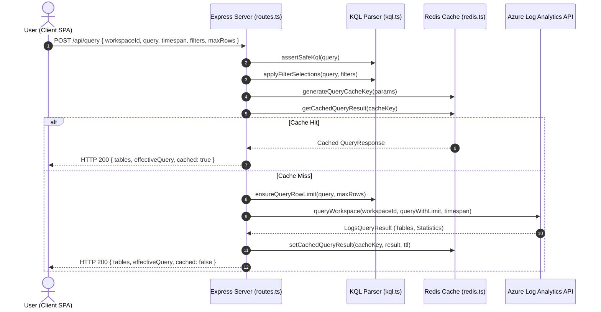

# Azure Log Analytics Explorer — Server Architecture & File Relationship Guide

## 1. Overview & System Architecture

The **Azure Log Analytics Explorer Server** is a production-grade Node.js/Express backend built with TypeScript. It acts as an enterprise gateway, query processor, security proxy, and intelligent caching layer between the React client and Azure Log Analytics / Azure OpenAI services.

```mermaid
flowchart TD
    Client[React Client SPA] -->|HTTP / REST API| Express[Express Server :8080]
    
    subgraph Express Pipeline [Express Middleware Pipeline]
        Helmet[Helmet Security & CSP] --> CORS[CORS Whitelist]
        CORS --> RateLimiter[Rate Limiter: 300 req/min]
        RateLimiter --> Logger[HTTP Diagnostics Logger]
        Logger --> RuntimeConfig["/runtime-config.js Dynamic Injector"]
        RuntimeConfig --> APIRouter["/api Router (routes.ts)"]
    end
    
    APIRouter -->|KQL Safety & Filter Parsing| KQL[KQL Engine (kql.ts)]
    APIRouter -->|Per-User Key Generation & Cache| Redis[(Redis Cache :6379)]
    APIRouter -->|Logs Query Execution| AzureLogs[Azure Log Analytics API]
    APIRouter -->|AI Assistant Queries| AzureOpenAI[Azure OpenAI Service]
    APIRouter -->|Parse Workspaces| WSConfig[Workspace Config Parser]
```

---

## 2. Directory Structure & File Map

```
server/
├── src/
│   ├── index.ts              # Entry point: Express bootstrapping, middleware & SPA serving
│   ├── routes.ts             # API route controllers & Zod input validation schemas
│   ├── config.ts             # Environment configuration & Zod schema validation
│   ├── kql.ts                # KQL security assertions, AST filter parsing & query mutators
│   ├── kql.test.ts           # Unit tests for KQL security & query manipulation
│   ├── logAnalytics.ts       # Azure LogsQueryClient & authentication credentials provider
│   ├── redis.ts              # Redis client, SHA-256 query cache key generator & invalidation
│   ├── chat.ts               # Azure OpenAI client for KQL assistance & prompt guardrails
│   ├── workspaceConfig.ts    # Multi-tenant workspace string parser
│   └── types.ts              # Server-side TypeScript interfaces & types
├── package.json              # Server dependencies, scripts, and build targets
└── tsconfig.json             # TypeScript compiler configuration (ESNext / NodeNext)
```

---

## 3. Code File Relationship & Dependency Matrix

| Source File | Primary Purpose | Imports From | Exported Functions / Symbols |
| :--- | :--- | :--- | :--- |
| [`server/src/index.ts`](file:///d:/Dinesh/LogAnalytics/server/src/index.ts) | Application entrypoint, HTTP server, CSP/CORS, rate limiting, static asset serving | [`config.ts`](file:///d:/Dinesh/LogAnalytics/server/src/config.ts), [`routes.ts`](file:///d:/Dinesh/LogAnalytics/server/src/routes.ts) | Express HTTP server listener |
| [`server/src/routes.ts`](file:///d:/Dinesh/LogAnalytics/server/src/routes.ts) | API endpoints (`/health`, `/workspaces`, `/parse`, `/query`, `/cache/*`, `/chat`) | [`config.ts`](file:///d:/Dinesh/LogAnalytics/server/src/config.ts), [`kql.ts`](file:///d:/Dinesh/LogAnalytics/server/src/kql.ts), [`logAnalytics.ts`](file:///d:/Dinesh/LogAnalytics/server/src/logAnalytics.ts), [`chat.ts`](file:///d:/Dinesh/LogAnalytics/server/src/chat.ts), [`workspaceConfig.ts`](file:///d:/Dinesh/LogAnalytics/server/src/workspaceConfig.ts), [`redis.ts`](file:///d:/Dinesh/LogAnalytics/server/src/redis.ts) | `router` |
| [`server/src/config.ts`](file:///d:/Dinesh/LogAnalytics/server/src/config.ts) | Environment loader (`.env`), type-safe config parsing with Zod | *None (external `dotenv`, `zod`)* | `config` |
| [`server/src/kql.ts`](file:///d:/Dinesh/LogAnalytics/server/src/kql.ts) | Query AST filter parser, safe assertion, filter remover, row limit & truncation injector | [`types.ts`](file:///d:/Dinesh/LogAnalytics/server/src/types.ts) | `assertSafeKql`, `parseFilters`, `applyFilterSelections`, `ensureQueryRowLimit` |
| [`server/src/logAnalytics.ts`](file:///d:/Dinesh/LogAnalytics/server/src/logAnalytics.ts) | Azure SDK integration, SPN/Azure CLI/DefaultAzureCredential authentication & query execution | [`config.ts`](file:///d:/Dinesh/LogAnalytics/server/src/config.ts), [`kql.ts`](file:///d:/Dinesh/LogAnalytics/server/src/kql.ts), [`types.ts`](file:///d:/Dinesh/LogAnalytics/server/src/types.ts) | `queryWorkspaceLogs` |
| [`server/src/redis.ts`](file:///d:/Dinesh/LogAnalytics/server/src/redis.ts) | Resilient Redis caching, per-user SHA-256 cache key isolation, TTL handling | [`config.ts`](file:///d:/Dinesh/LogAnalytics/server/src/config.ts), [`types.ts`](file:///d:/Dinesh/LogAnalytics/server/src/types.ts) | `generateQueryCacheKey`, `getCachedQueryResult`, `setCachedQueryResult`, `clearUserCache`, `getRedisStatus`, `extractUserIdentifier` |
| [`server/src/chat.ts`](file:///d:/Dinesh/LogAnalytics/server/src/chat.ts) | Azure OpenAI completion handler with strict KQL/Azure-only system prompt | [`config.ts`](file:///d:/Dinesh/LogAnalytics/server/src/config.ts) | `generateChatResponse` |
| [`server/src/workspaceConfig.ts`](file:///d:/Dinesh/LogAnalytics/server/src/workspaceConfig.ts) | Multi-format workspace configuration string parser | *None (pure helper)* | `parseWorkspaceEntries`, `WorkspaceEntry` |
| [`server/src/types.ts`](file:///d:/Dinesh/LogAnalytics/server/src/types.ts) | Data transfer objects for KQL filters, tables, and query responses | *None* | `ParsedFilter`, `FilterSelection`, `QueryTable`, `QueryResponse` |

---

## 4. Module Deep Dives & Data Flow

### 4.1 Server Entry Point & Middleware (`index.ts`)
1. **Security & Content Security Policy**: Configures `helmet` with CSP directives allowing Microsoft login, Graph API, Azure Resource Manager, Log Analytics API, and Google Fonts.
2. **CORS Management**: Dynamically validates origins against configured whitelist, localhost/127.0.0.1, LAN subnets, and wildcard rules.
3. **API Rate Limiter**: Implements `express-rate-limit` (default: 300 requests/minute) scoped strictly to `/api` routes so static assets, JavaScript bundles, and `/runtime-config.js` are never blocked.
4. **Dynamic Runtime Configuration (`/runtime-config.js`)**: Generates dynamic client configurations injected at container runtime, eliminating the need to rebuild frontend assets across environments (Dev, Staging, Prod).
5. **Static Client SPA Serving**: In production or containerized environments, serves `client/dist` static assets and handles SPA client-side routing fallback.

### 4.2 Route Controllers & API Contracts (`routes.ts`)

| Endpoint | Method | Input Validation (Zod) | Description |
| :--- | :--- | :--- | :--- |
| `/api/health` | `GET` | — | System health, workspace configuration status, and server timestamp. |
| `/api/workspaces` | `GET` | — | Parses configured subscriptions and workspaces via `workspaceConfig.ts`. |
| `/api/parse` | `POST` | `parseBodySchema`: `{ query: string (1-20000 chars) }` | Parses `where` clauses from KQL and returns interactive filter objects. |
| `/api/query` | `POST` | `queryBodySchema`: `{ workspaceId?: string, query: string, timespan: string, filters: FilterSelection[], maxRows: number }` | Executes KQL query via Redis cache check → Azure Monitor Log Analytics API. |
| `/api/cache/status`| `GET` | — | Current Redis connection state, host/port, and configured TTL. |
| `/api/cache/clear` | `POST` | Authorization header (Bearer token) | Invalidates all cached query keys belonging to the authenticated user. |
| `/api/chat` | `POST` | `chatBodySchema`: `{ messages: Array<{ role, content }> }` | Sends user query to Azure OpenAI KQL Assistant. |

### 4.3 KQL Engine & Security Validation (`kql.ts`)
- **Safety Assertions (`assertSafeKql`)**: Blocks destructive/operational KQL commands (`.create`, `.delete`, `.drop`, `.alter`, `.set`, `.ingest`) and validates query length limits.
- **Top-Level Parser (`parseFilters`, `splitTopLevelAnd`)**: Accurately extracts `where` clauses while respecting parenthesis depth, string literals, and nested logical operators.
- **Selective Filter Mutation (`applyFilterSelections`)**: Removes disabled filters from the KQL string cleanly while preserving surrounding syntactic operators (`and`).
- **Row Limit & Truncation Injection (`ensureQueryRowLimit`)**:
  - Dynamically updates or inserts `| take <maxRows>` before `| render` clauses or at the query end.
  - Automatically injects `set truncationmaxrecords = <cap>; set notruncation;` when row limits exceed 5,000 to prevent Azure API truncation.

### 4.4 Azure Monitor Log Analytics Integration (`logAnalytics.ts`)
- **Authentication Escalation Hierarchy**:
  1. **User Delegated Token**: If a `Bearer <token>` is present in the request authorization header (from client Azure AD MSAL authentication), uses user token directly for Azure RBAC compliance.
  2. **Service Principal (SPN)**: If `AZURE_TENANT_ID`, `AZURE_CLIENT_ID`, and `AZURE_CLIENT_SECRET` are provided in `.env`.
  3. **DefaultAzureCredential / Azure CLI Chain**: Falls back to `ChainedTokenCredential(DefaultAzureCredential, AzureCliCredential)`.
- **Query Execution**: Executes query with configured timeout (`QUERY_TIMEOUT_MS`) and requests server-side execution statistics.
- **Error Normalization**: Maps Azure SDK error objects into actionable user guidance (e.g., prompt for `az login` or Azure AD authentication).

### 4.5 Redis Caching Subsystem (`redis.ts`)
- **User-Isolated Cache Keys**: Computes compound SHA-256 hash incorporating `workspaceId`, `timespan`, `maxRows`, `normalizedQuery`, and the authenticated user identity (extracted from Azure AD JWT token `oid`/`sub`/`upn`).
  ```
  loganalytics:query:user_<userId>:<querySha256Hash>
  ```
- **Non-Blocking Resilience**: Operates with non-blocking error handling (`lazyConnect`, retry strategies). If Redis is unreachable, the system automatically falls back to direct Azure execution without interrupting user workflow.
- **Per-User Cache Clearing (`clearUserCache`)**: Uses Redis key pattern matching scoped strictly to the current user's namespace (`loganalytics:query:user_<id>:*`).

### 4.6 Azure OpenAI KQL Assistant (`chat.ts`)
- Configured with strict domain system prompt:
  ```
  You are an AI assistant built into an Azure Log Analytics KQL application.
  Your ONLY purpose is to help users write, debug, and understand Kusto Query Language (KQL) queries...
  ```
- Uses low temperature (`0.1`) for precise, deterministic KQL query generation and debugging.

---

## 5. Sequence Diagram: Query Execution Flow



---

## 6. Environment Configuration Reference

The server validates all configuration variables via Zod in [`config.ts`](file:///d:/Dinesh/LogAnalytics/server/src/config.ts):

| Variable | Type | Default | Description |
| :--- | :--- | :--- | :--- |
| `PORT` | Number | `8080` | Express HTTP listening port |
| `NODE_ENV` | String | `development` | Node environment (`development` / `production` / `test`) |
| `CORS_ORIGIN` | String | `http://localhost:5173` | Allowed CORS origins (comma-separated or `*`) |
| `LOG_ANALYTICS_WORKSPACE_ID` | GUID | `""` | Fallback Azure Log Analytics Workspace Customer ID |
| `ALLOW_WORKSPACE_OVERRIDE` | Boolean | `false` | Allow switching workspaces without individual user token |
| `QUERY_TIMEOUT_MS` | Number | `120000` (2m) | Azure Log Analytics API query timeout in ms |
| `QUERY_MAX_ROWS` | Number | `50000` | Maximum rows allowable from backend query |
| `QUERY_MAX_LENGTH` | Number | `20000` | Maximum allowed character length for KQL query |
| `RATE_LIMIT_MAX` | Number | `300` | Max requests per minute per IP for `/api/*` |
| `REDIS_ENABLED` | Boolean | `true` | Enable/disable Redis query caching |
| `REDIS_HOST` | String | `localhost` / `redis-logapp-svc` | Redis server hostname |
| `REDIS_PORT` | Number | `6379` | Redis server port |
| `REDIS_CACHE_TTL_SECONDS` | Number | `500` | TTL in seconds for cached query results |
| `AZURE_OPENAI_ENDPOINT` | URL | `""` | Azure OpenAI instance endpoint |
| `AZURE_OPENAI_API_KEY` | String | `""` | Azure OpenAI API key |
| `AZURE_OPENAI_DEPLOYMENT`| String | `""` | Azure OpenAI model deployment name |
| `VITE_REQUIRE_AZURE_AD_AUTH` | String | `"false"` | Require user Azure AD login on frontend |
| `VITE_WORKSPACES` | String | `""` | Comma-separated list of workspaces (`Sub/Name:Id`) |
