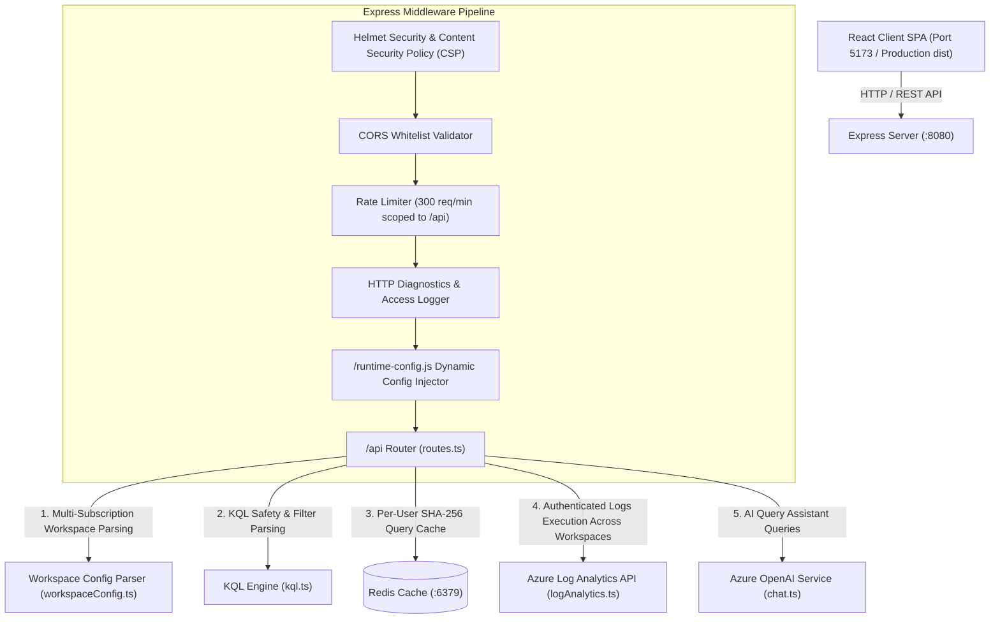
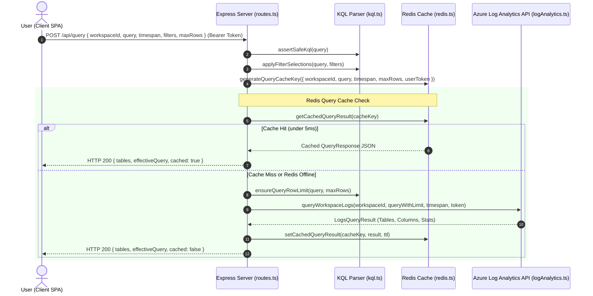

# Server Backend Architecture & File Relationship Guide

## 1. Overview & System Architecture

The **Azure Log Analytics Explorer Server** is an enterprise-grade Node.js/Express backend built with TypeScript. It serves as the API gateway, KQL security sanitizer, query processor, per-user caching layer, multi-subscription workspace resolver, and AI assistant proxy connecting the React client with **Azure Log Analytics** (Azure Monitor) and **Azure OpenAI** services.


```mermaid
flowchart TD
    Client["React Client SPA (Port 5173 / Production dist)"] -->|"HTTP / REST API"| Express["Express Server (:8080)"]
    
    subgraph ExpressPipeline ["Express Middleware Pipeline"]
        Helmet["Helmet Security & Content Security Policy (CSP)"] --> CORS["CORS Whitelist Validator"]
        CORS --> RateLimiter["Rate Limiter (300 req/min scoped to /api)"]
        RateLimiter --> Logger["HTTP Diagnostics & Access Logger"]
        Logger --> RuntimeConfig["/runtime-config.js Dynamic Config Injector"]
        RuntimeConfig --> APIRouter["/api Router (routes.ts)"]
    end
    
    APIRouter -->|"1. Multi-Subscription Workspace Parsing"| WSConfig["Workspace Config Parser (workspaceConfig.ts)"]
    APIRouter -->|"2. KQL Safety & Filter Parsing"| KQL["KQL Engine (kql.ts)"]
    APIRouter -->|"3. Per-User SHA-256 Query Cache"| Redis[("Redis Cache (:6379)")]
    APIRouter -->|"4. Authenticated Logs Execution Across Workspaces"| AzureLogs["Azure Log Analytics API (logAnalytics.ts)"]
    APIRouter -->|"5. AI Query Assistant Queries"| AzureOpenAI["Azure OpenAI Service (chat.ts)"]
```

---

## 2. Directory Structure & File Map

```
server/
├── package.json              # Server dependencies, Node 22 engines, scripts and build targets
├── tsconfig.json             # TypeScript compiler configuration (ESNext / NodeNext)
├── vitest.config.ts          # Vitest testing configuration
└── src/
    ├── index.ts              # Entry point: Express server bootstrapping, security middleware & SPA serving
    ├── routes.ts             # API route controllers, Zod request validation schemas & route handlers
    ├── config.ts             # Type-safe environment variable parsing & Zod schema validation
    ├── kql.ts                # KQL security assertions, AST filter parsing, query mutators & limit injector
    ├── kql.test.ts           # Comprehensive unit tests for KQL security, parsing & query mutation
    ├── logAnalytics.ts       # Azure LogsQueryClient integration, credential provider & query runner
    ├── redis.ts              # Resilient Redis client, per-user SHA-256 key generator & cache invalidation
    ├── chat.ts               # Azure OpenAI client for KQL assistance with system prompt guardrails
    ├── workspaceConfig.ts    # Multi-subscription & multi-workspace string parser (Subscription/Name:Id)
    └── types.ts              # Server-side TypeScript interfaces, DTOs & data contracts
```

---

## 3. Code File Relationship & Dependency Matrix

| Source File | Primary Purpose | Imports From | Exported Functions / Symbols |
| :--- | :--- | :--- | :--- |
| [`server/src/index.ts`](file:///d:/Dinesh/LogAnalytics/server/src/index.ts) | HTTP server bootstrapping, Helmet CSP, CORS, rate limiting, dynamic `/runtime-config.js` and SPA static serving | [`config.ts`](file:///d:/Dinesh/LogAnalytics/server/src/config.ts), [`routes.ts`](file:///d:/Dinesh/LogAnalytics/server/src/routes.ts) | Express HTTP server listener |
| [`server/src/routes.ts`](file:///d:/Dinesh/LogAnalytics/server/src/routes.ts) | API endpoints (`/health`, `/workspaces`, `/parse`, `/query`, `/cache/*`, `/chat`) with Zod schemas | [`config.ts`](file:///d:/Dinesh/LogAnalytics/server/src/config.ts), [`kql.ts`](file:///d:/Dinesh/LogAnalytics/server/src/kql.ts), [`logAnalytics.ts`](file:///d:/Dinesh/LogAnalytics/server/src/logAnalytics.ts), [`chat.ts`](file:///d:/Dinesh/LogAnalytics/server/src/chat.ts), [`workspaceConfig.ts`](file:///d:/Dinesh/LogAnalytics/server/src/workspaceConfig.ts), [`redis.ts`](file:///d:/Dinesh/LogAnalytics/server/src/redis.ts) | `router` |
| [`server/src/config.ts`](file:///d:/Dinesh/LogAnalytics/server/src/config.ts) | Root `.env` loader, type-safe config schema validation with Zod | *None (external `dotenv`, `zod`)* | `config`, `EnvConfig` |
| [`server/src/kql.ts`](file:///d:/Dinesh/LogAnalytics/server/src/kql.ts) | KQL security assertions, AST filter parsing, disabled filter stripping, row limit & truncation injector | [`types.ts`](file:///d:/Dinesh/LogAnalytics/server/src/types.ts) | `assertSafeKql`, `parseFilters`, `applyFilterSelections`, `ensureQueryRowLimit` |
| [`server/src/logAnalytics.ts`](file:///d:/Dinesh/LogAnalytics/server/src/logAnalytics.ts) | Azure Monitor Logs execution, delegated user token handling, SPN / Managed Identity credential chaining | [`config.ts`](file:///d:/Dinesh/LogAnalytics/server/src/config.ts), [`kql.ts`](file:///d:/Dinesh/LogAnalytics/server/src/kql.ts), [`types.ts`](file:///d:/Dinesh/LogAnalytics/server/src/types.ts) | `queryWorkspaceLogs` |
| [`server/src/redis.ts`](file:///d:/Dinesh/LogAnalytics/server/src/redis.ts) | Resilient Redis caching, per-user compound SHA-256 key isolation, TTL handling & cache clearing | [`config.ts`](file:///d:/Dinesh/LogAnalytics/server/src/config.ts), [`types.ts`](file:///d:/Dinesh/LogAnalytics/server/src/types.ts) | `generateQueryCacheKey`, `getCachedQueryResult`, `setCachedQueryResult`, `clearUserCache`, `getRedisStatus`, `extractUserIdentifier` |
| [`server/src/chat.ts`](file:///d:/Dinesh/LogAnalytics/server/src/chat.ts) | Azure OpenAI completion handler with strict KQL domain guardrail prompt | [`config.ts`](file:///d:/Dinesh/LogAnalytics/server/src/config.ts) | `generateChatResponse` |
| [`server/src/workspaceConfig.ts`](file:///d:/Dinesh/LogAnalytics/server/src/workspaceConfig.ts) | Multi-subscription workspace configuration parser (`Subscription/Name:CustomerId`) | *None (pure helper)* | `parseWorkspaceEntries`, `WorkspaceEntry` |
| [`server/src/types.ts`](file:///d:/Dinesh/LogAnalytics/server/src/types.ts) | Data transfer objects for filters, tables, and query responses | *None* | `ParsedFilter`, `FilterSelection`, `QueryTable`, `QueryResponse` |
| [`server/src/kql.test.ts`](file:///d:/Dinesh/LogAnalytics/server/src/kql.test.ts) | Vitest test suite validating safety assertions, filter parsing, and query modifications | [`kql.ts`](file:///d:/Dinesh/LogAnalytics/server/src/kql.ts) | Test suites |

---

## 4. Module Deep Dives & Implementation Details

### 4.1 Multi-Subscription Workspace Parsing ([`workspaceConfig.ts`](file:///d:/Dinesh/LogAnalytics/server/src/workspaceConfig.ts))
- Parses comma-separated workspace strings configured in `VITE_WORKSPACES` or `LOG_ANALYTICS_WORKSPACE_ID`:
  ```
  SubscriptionA/EastUS-Logs:11111111-1111-1111-1111-111111111111,SubscriptionB/EU-Logs:22222222-2222-2222-2222-222222222222
  ```
- Normalizes workspace entries into structured `WorkspaceEntry` records (`id`, `name`, `customerId`, `subscriptionName`) served via `/api/workspaces`.

### 4.2 Server Entry Point & Middleware Pipeline ([`index.ts`](file:///d:/Dinesh/LogAnalytics/server/src/index.ts))
1. **Security & Content Security Policy (CSP)**: Configures `helmet` with custom CSP directives allowing authentication (`login.microsoftonline.com`), Azure Resource Graph (`management.azure.com`), Azure Log Analytics (`api.loganalytics.io`), and Google Fonts.
2. **Dynamic CORS Whitelist**: Evaluates incoming request `Origin` headers against configured `CORS_ORIGIN` lists, local dev ports (`5173`, `5010`, `8080`), and local network subnets.
3. **API Rate Limiting**: Implements `express-rate-limit` (default: 300 req/min per IP) scoped strictly to `/api` routes.
4. **Dynamic Runtime Configuration (`/runtime-config.js`)**: Injects runtime configuration from environment variables into browser clients, supporting zero-rebuild container deployments.
5. **Static SPA Serving**: Serves pre-built static assets from `client/dist` and handles SPA routing fallback in production.

---

### 4.3 Route Controllers & API Contracts ([`routes.ts`](file:///d:/Dinesh/LogAnalytics/server/src/routes.ts))

| Endpoint | Method | Input Validation (Zod Schema) | Description |
| :--- | :--- | :--- | :--- |
| `/api/health` | `GET` | — | Returns backend health, configured workspace status, port, and timestamp. |
| `/api/workspaces` | `GET` | — | Returns list of configured subscriptions and workspaces parsed via `workspaceConfig.ts`. |
| `/api/parse` | `POST` | `parseBodySchema`: `{ query: string (1-20000 chars) }` | Parses `where` clauses from KQL and returns interactive filter objects. |
| `/api/query` | `POST` | `queryBodySchema`: `{ workspaceId?: string, query: string, timespan: string, filters: FilterSelection[], maxRows: number }` | Validates KQL, strips disabled filters, checks per-user Redis cache, and queries target Azure Log Analytics workspace. |
| `/api/cache/status` | `GET` | — | Returns Redis connection status, host/port, and configured TTL. |
| `/api/cache/clear` | `POST` | `Authorization: Bearer <token>` | Purges all cached query keys belonging to the authenticated user. |
| `/api/chat` | `POST` | `chatBodySchema`: `{ messages: Array<{ role: "system"|"user"|"assistant", content: string }> }` | Proxies user prompt to Azure OpenAI `gpt-4o` KQL assistant. |

---

### 4.4 KQL Engine & Security Validation ([`kql.ts`](file:///d:/Dinesh/LogAnalytics/server/src/kql.ts))
- **Safety Assertions (`assertSafeKql`)**: Blocks all administrative and destructive KQL commands (`.create`, `.delete`, `.drop`, `.alter`, `.set`, `.ingest`, `.purge`, `.show`, `.export`) and enforces query length limits (`QUERY_MAX_LENGTH=20000`).
- **AST Filter Parsing (`parseFilters`, `splitTopLevelAnd`)**: Accurately splits `where` clauses at top-level `and` boundaries while respecting nested parentheses, string literals, and bracket depth.
- **Selective Filter Mutation (`applyFilterSelections`)**: Strips disabled filter clauses from the query string cleanly while preserving valid syntax.
- **Row Limit & Truncation Injection (`ensureQueryRowLimit`)**: Automatically injects `set truncationmaxrecords = <maxRows>; set notruncation;` when `maxRows` exceeds 5,000 to prevent Azure API result truncation.

---

### 4.5 Azure Monitor Log Analytics Integration ([`logAnalytics.ts`](file:///d:/Dinesh/LogAnalytics/server/src/logAnalytics.ts))
- **Authentication Escalation Hierarchy**:
  1. **Delegated User Bearer Token**: If a `Bearer <token>` is present in the request Authorization header (from MSAL authentication), uses the user's token directly with `createBearerTokenCredential()`, ensuring full compliance with Azure RBAC permissions on the target workspace.
  2. **Service Principal (SPN)**: If `AZURE_TENANT_ID`, `AZURE_CLIENT_ID`, and `AZURE_CLIENT_SECRET` are configured in `.env`.
  3. **DefaultAzureCredential / Azure CLI Chain**: Falls back to `ChainedTokenCredential(DefaultAzureCredential, AzureCliCredential)`.
- **Query Execution & Formatting**: Uses `@azure/monitor-query-logs` (`LogsQueryClient`) to execute queries against target workspace UUIDs with configurable timeouts (`QUERY_TIMEOUT_MS`).

---

### 4.6 Per-User Isolated Redis Caching Subsystem ([`redis.ts`](file:///d:/Dinesh/LogAnalytics/server/src/redis.ts))
- **Compound SHA-256 Keying per User**: Generates deterministic compound cache keys incorporating workspace ID, timespan, max rows, normalized KQL query string, and user identity (`oid`, `sub`, or `upn`):
  ```
  loganalytics:query:user_<userId>:<sha256Hash>
  ```
- **Non-Blocking Resilience**: If Redis is unreachable or restarting, requests automatically bypass the cache and query Azure Log Analytics directly without throwing 500 errors.
- **User Cache Invalidation (`clearUserCache`)**: Scans and deletes only the keys belonging to the authenticated user's namespace (`loganalytics:query:user_<userId>:*`).

---

### 4.7 Azure OpenAI KQL Assistant ([`chat.ts`](file:///d:/Dinesh/LogAnalytics/server/src/chat.ts))
- Integrates the `openai` SDK configured with Azure OpenAI endpoints (`AZURE_OPENAI_ENDPOINT`, `AZURE_OPENAI_API_KEY`, `AZURE_OPENAI_DEPLOYMENT`).
- Uses a strict system prompt restricting the assistant solely to KQL query composition and optimization for Azure Log Analytics schemas with `temperature: 0.1`.

---

## 5. Sequence Diagram: Query Execution Flow


```mermaid
sequenceDiagram
    autonumber
    actor User as User (Client SPA)
    participant Server as Express Server (routes.ts)
    participant KQL as KQL Parser (kql.ts)
    participant Redis as Redis Cache (redis.ts)
    participant Azure as Azure Log Analytics API (logAnalytics.ts)

    User->>Server: POST /api/query { workspaceId, query, timespan, filters, maxRows } (Bearer Token)
    Server->>KQL: assertSafeKql(query)
    Server->>KQL: applyFilterSelections(query, filters)
    Server->>Redis: generateQueryCacheKey({ workspaceId, query, timespan, maxRows, userToken })
    
    rect rgb(240, 255, 240)
        Note over Server,Redis: Redis Query Cache Check
        Server->>Redis: getCachedQueryResult(cacheKey)
        alt Cache Hit (under 5ms)
            Redis-->>Server: Cached QueryResponse JSON
            Server-->>User: HTTP 200 { tables, effectiveQuery, cached: true }
        else Cache Miss or Redis Offline
            Server->>KQL: ensureQueryRowLimit(query, maxRows)
            Server->>Azure: queryWorkspaceLogs(workspaceId, queryWithLimit, timespan, token)
            Azure-->>Server: LogsQueryResult (Tables, Columns, Stats)
            Server->>Redis: setCachedQueryResult(cacheKey, result, ttl)
            Server-->>User: HTTP 200 { tables, effectiveQuery, cached: false }
        end
    end
```

---

## 6. Environment Configuration Reference

All environment variables are parsed and validated via Zod in [`config.ts`](file:///d:/Dinesh/LogAnalytics/server/src/config.ts):

| Variable | Type | Default | Description |
| :--- | :--- | :--- | :--- |
| `PORT` | Number | `8080` | Port the Express API server listens on |
| `NODE_ENV` | String | `development` | Node environment (`development` / `production` / `test`) |
| `CORS_ORIGIN` | String | `http://localhost:5173` | Allowed CORS origins (comma-separated list) |
| `LOG_ANALYTICS_WORKSPACE_ID` | String | `""` | Fallback Azure Log Analytics Workspace Customer ID (UUID) |
| `ALLOW_WORKSPACE_OVERRIDE` | Boolean | `false` | Allow clients to query arbitrary workspace IDs without user token |
| `QUERY_TIMEOUT_MS` | Number | `120000` (2m) | Azure Log Analytics API query timeout in milliseconds |
| `QUERY_MAX_ROWS` | Number | `50000` | Maximum rows allowable from backend query execution |
| `QUERY_MAX_LENGTH` | Number | `20000` | Maximum allowed character length for incoming KQL queries |
| `RATE_LIMIT_MAX` | Number | `300` | Max requests per minute per IP for `/api/*` endpoints |
| `REDIS_ENABLED` | Boolean | `true` | Enable or disable Redis query caching subsystem |
| `REDIS_HOST` | String | `localhost` / `redis-logapp-svc` | Redis server hostname |
| `REDIS_PORT` | Number | `6379` | Redis server port |
| `REDIS_PASSWORD` | String | `""` | Redis authentication password (if required) |
| `REDIS_URL` | String | `""` | Full connection URI for Redis (alternative to host/port) |
| `REDIS_CACHE_TTL_SECONDS` | Number | `500` | Expiration time for cached query results in seconds |
| `AZURE_TENANT_ID` | String | `""` | Azure AD Directory (Tenant) ID for Service Principal |
| `AZURE_CLIENT_ID` | String | `""` | Azure AD Application (Client) ID for Service Principal / Managed Identity |
| `AZURE_CLIENT_SECRET` | String | `""` | Azure AD Client Secret for Service Principal |
| `AZURE_OPENAI_ENDPOINT` | URL | `""` | Azure OpenAI instance endpoint URL |
| `AZURE_OPENAI_API_KEY` | String | `""` | Azure OpenAI API key |
| `AZURE_OPENAI_DEPLOYMENT` | String | `""` | Azure OpenAI model deployment name (e.g. `gpt-4o`) |
| `VITE_REQUIRE_AZURE_AD_AUTH` | String | `"false"` | Require user Azure AD login on frontend |
| `VITE_WORKSPACES` | String | `""` | Comma-separated list of multi-subscription workspaces (`Subscription/Name:CustomerId`) |
| `VITE_ALLOWED_AZURE_AD_GROUPS` | String | `""` | Comma-separated Azure AD Security Group Object IDs/names |
